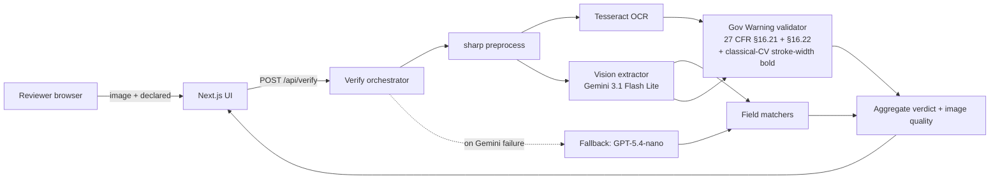

# Label Verify

[](https://github.com/XanderXML-Bit/label-verify/actions/workflows/ci.yml)
[](https://github.com/XanderXML-Bit/label-verify/actions/workflows/post-deploy-smoke.yml)
[](https://label-verify-six.vercel.app)
[](#license)

> Vision-LLM verification of beverage-label artwork against COLA application data, with explicit Government-Warning compliance subscores per 27 CFR §16.21 / §16.22. Prototype demonstrating AI-assisted COLA verification for TTB-regulated alcohol labels.

**Live demo:** <https://label-verify-six.vercel.app> · **Repository:** <https://github.com/XanderXML-Bit/label-verify> · **API:** [`docs/openapi.yaml`](docs/openapi.yaml)

---

## At a glance

| Question | Answer |
|---|---|
| **What does it do?** | Drop a label image + COLA application data → get a `pass` / `fail` / `review` verdict on each of the 7 regulated fields plus the Government Warning subscore (27 CFR §16.21 / §16.22). |
| **Latency** | **Server-side P50 ~3.0 s** on the cross-pair bench (warm function, single image, vision call is the dominant cost). **Client-perceived end-to-end** measured on production via Playwright stopwatch (wave-35c): **~4.9–5.0 s warm** desktop, **~7–8 s cold** on the first verify after a Vercel function spin-up. The result panel surfaces both numbers — `Verified in 5.0 s (server 4.5 s)` — so the bench claim and the user-perceived reality are both visible. |
| **Field-level accuracy** | On the 170-image bench corpus (90 SVG-rendered synthetic + 80 photo-realistic AI-generated labels): the cross-pair benchmark (`npm run bench:cross-pair`) measures **70.41 % strict pass-rate on correct ground truth and 100 % fail-or-review on perturbed wrong ground truth**, with **0 deterministic compliant false-fails** and **2 deterministic adversarial.fp-on-correct** (wave-31j drove these 6→2 via Lanczos upscaling to 2000-px long edge; wave-33's deep-audit bug fixes nudged pass-rate 69.82 % → 70.41 % on the same corpus). The regulator-critical `compliant.false-pass-on-correct` metric on real-photo labels remains **zero across every wave since 22**. Bare-extractor field-level accuracy on the bake-off is ~96 % on synthetic and ~99 % on photo-realistic. The Government-Warning false-negative rate is **~5 %** (Wilson 95 % CI upper 10.2 %, n = 137 non-compliant labels). See [Headline measurement](#headline-measurement), `docs/WAVE-28a-STRATIFIED-GUARDRAIL.md` for the stratified criterion, `docs/WAVE-31j-UPSCALE-2000-SHIPPABLE.md` for the wave-31j rationale, and [Scope and limitations](#scope-and-limitations). |
| **Cost** | **≈ $0.25 per 1,000 labels** on the deployed primary (Gemini 3.1 Flash Lite at the current Google rate card: $0.25 / 1M input, $1.50 / 1M output; a typical verify call uses ~700 input + ~250 output tokens). Same-provider second-opinion calls (Gemini 2.5 Flash, ~5–15 % of verifications, only when the Government-Warning subscore is borderline) add ~$0.001 each. |
| **Auto-pair batches?** | Yes. **Four-stage pairing**: (1) inline-manifest detection (one dropped CSV/JSON with N rows + a `filename` column → N pairs; filename-keyed JSON object maps are also auto-detected), (2) filename stem matching (face-tag and app-tag aware), (3) content-based fallback (brand + class similarity from a lightweight vision extraction), (4) single-application broadcast (1 app file + N images → broadcast same fields to all, surfaced as a warning). Handles randomly-named files, partial coverage (5 images + 20-row manifest → 5 pairs + 15 orphan rows flagged), and one-CSV-covers-all (12 images + 1 12-row CSV → 12 pairs). The batch UI shows a determinate progress bar with the four stages labelled as it advances. |
| **Single image + roster manifest?** | Yes. Drop one image + a multi-row manifest together (or upload the manifest after the image); the parser picks the row matching the image's filename. Multi-row CSV / JSON with a `filename` column and filename-keyed JSON object maps both work. |
| **Simple or detailed view?** | A header toggle (next to dark mode) flips the result panel between **Simple** (verdict + Government-Warning status + only the failing/review fields with their reasons) and **Detailed** (full per-subscore breakdown, extractor confidences, second-opinion panel, per-call timing). Default = Simple. Choice persists per browser. |
| **What languages?** | English-primary, but country names recognised in **7 languages** across **25 countries** (Spanish, French, German, Italian, Portuguese, Japanese 日本, Korean 대한민국, Greek Ελλάδα, Chinese 中国). Gov-Warning text is the federal English statement by regulation. |
| **What if Gemini is down?** | Cross-provider auto-fallback to GPT-5.4-nano (OpenAI) on primary failure, with a yellow "verified via backup" banner on the verdict. Separate from the second-opinion path. |
| **Second opinion?** | On borderline Gov-Warning (`REVIEW` or low-confidence PASS without OCR corroboration), an independent second-opinion model (default **Gemini 2.5 Flash** since wave 22) re-reads the label. Agreement / disagreement is surfaced inline. Operator can route this to OpenAI instead via `SECOND_OPINION_PROVIDER=openai`. |
| **Can I try it now?** | Yes — the live URL has pre-populated PASS / FAIL / REVIEW samples; one click runs end-to-end against production. |
| **Code review** | **942 / 942** vitest tests passing across **89 test files**, zero ESLint warnings, typecheck clean, production build green, branch protection on `main`, 0 production-dependency vulnerabilities. Multiple independent audit passes (Hermes, Codex, sub-agent code review, sub-agent fixture audit, sub-agent docs audit, sub-agent perf/accuracy audit, sub-agent production-readiness smoke, sub-agent GUI-simplification audit, sub-agent wave-22-25 second-opinion swap + Gov-Warning case-fold + class-generic acceptance + null-extraction safety net, sub-agent wave-27 primary-model bake-off). |

**How to read this report**

- **30-second skim** — live demo + the table above.
- **5-minute review** — [Try it now](#try-it-now) → [Architecture](#architecture-at-a-glance) → [How the verdict is computed](#how-the-verdict-is-computed).
- **30-minute review** — [Headline measurement](#headline-measurement) → [Methods considered](#methods-considered) → [`docs/MODEL-SELECTION.md`](docs/MODEL-SELECTION.md) → [Validation methodology](#validation-methodology).
- **Production review** — [Verified state](#verified-state) → [`SECURITY.md`](SECURITY.md) → [`docs/DEPLOYMENT.md`](docs/DEPLOYMENT.md) → [`docs/openapi.yaml`](docs/openapi.yaml).

---

## Try it now

```
1. Open https://label-verify-six.vercel.app
2. Click any of the three "Try a sample" cards (PASS / FAIL / REVIEW)
3. Read the verdict + the 7-field breakdown + Gov-Warning subscores
```

No install, no key, no signup. The samples ship matching COLA application data so reviewers can see end-to-end behaviour on first click.

**Or upload your own:** drop any beverage-label image (JPEG / PNG / WebP / HEIC) into the dropzone; the form opens for the seven declared fields. Verdict returns in **~4–6 seconds end-to-end** on a warm function (server-side P50 ~3 s; the remainder is client-side image compression, network round-trip, and React render). First request after a cold Vercel function spin-up adds another ~2–3 s. Per-call timings are surfaced on the result panel as `Verified in N s (server N s)` so the bench claim and the user-perceived reality are both visible.

**Or upload a label + an application file together:** drop both at once (image + PDF / JSON / CSV / Markdown / DOCX / photo of the form). The parser prefills the editable form; you confirm or edit; then Verify. PDFs without extractable text (scanned forms) auto-fall back to vision OCR.

**Or upload a batch:** drop multiple images and their application files in one shot. **No manifest required** — the server pairs each image to its matching application data through a **four-stage strategy**, in order of cost (cheapest first):

1. **Inline-manifest detection** — when a single CSV or JSON with multiple rows is dropped alongside images and the file has a `filename` / `file` / `image` / `label` / `cola_number` / `id` column, every row is expanded into a per-image pair. So 12 images + one 12-row CSV → 12 pairs. 5 images + a 20-row CSV → 5 pairs + 15 rows flagged as orphans the operator can act on.
2. **Filename stem matching** — case-insensitive, face-tag-aware (`123-front.jpg` ↔ `123-back.jpg` ↔ `123.pdf`), app-tag-aware (`123-front.jpg` ↔ `123-app.pdf`).
3. **Content-based fallback** for anything still unpaired. Parses each unpaired application's brand + class + ABV and runs a lightweight vision extraction on each unpaired image; greedy-matches by weighted similarity (brand 0.65, class 0.25, ABV 0.10) with a 0.55 threshold. Handles completely randomly-named files (a folder of `DSC_001.jpg` / `DSC_002.jpg` + `app1.pdf` / `app2.pdf` still matches correctly).
4. **Single-application broadcast** — when ≥ 2 unpaired images remain alongside exactly 1 unpaired single-product application file, the same parsed fields are broadcast to every image, with a warning surfaced so the operator can reject if the images are actually different products.

The UI shows a "Detected N images + M application files" summary card before any vision call fires. The images-only batch screen embeds a second `UploadZone` so you can drop the application file there (no text-paste required). Explicit manifest paste is still accepted in a collapsed `<details>` override for power users. Results stream back over SSE; download as JSON or CSV.

**Or skip the application data entirely:** the form's secondary "Skip — extract fields without a verdict" button runs the extractor and the Gov-Warning subscore (federal-regulation, independent of any application data) and returns extracted fields with a yellow "this is not a verification" banner — for the case where you just want to see what's on the label.

---

## Headline measurement

**Test corpus.** 170 images on disk in `test-data-combined/`:

- **90 SVG-rendered synthetic** labels (`test-data-v2/labels/*.png`) — vector-rendered from deterministic templates with hand-controlled Government-Warning failure modes (the case taxonomy in [`docs/government-warning-cases.md`](docs/government-warning-cases.md)).
- **80 photo-realistic AI-generated** labels (`test-data/ai-generated/labels/*.jpg`) — Codex image-gen across two batches (50 + 30) with explicit stress-cases for paraphrase, photo-quality degradation (perspective / glare / lowlight / occlusion / motion-blur / aged-paper / shrink-wrap / curved-substrate), bilingual EN/ES warnings, and novel beverage categories (hard cider, sake, hard kombucha, RTD cocktail, mead, malt seltzer).

Each image has a JSON ground-truth file describing its expected fields and Government-Warning compliance flags. Ground-truth construction followed a written prompt template (`docs/archive/CODEX-HANDOFF.md`), then an independent cross-validation pass with a separate vision model (Gemini 3.1 Pro Preview), then a four-sub-agent visual audit (SVG synthetic stratum + each AI-generated batch).

**Scoring.** Per-field PASS / FAIL / REVIEW from the seven comparators in `src/lib/matching/` plus the four Government-Warning subscores. The bench scorer treats `REVIEW` as not-correct (deliberately strict — see [Validation methodology](#validation-methodology) for rationale). Wilson 95 % CIs per stratum; McNemar pairwise tests between candidate models.

### Bench numbers

Two complementary measurements:

**Per-field bake-off** (`npm run bench:bakeoff`). T6 = Gemini 3.1 Flash Lite, 3 trials per image, deterministic seed where the provider exposes one.

| Subset | n images | Field-level accuracy | Wilson 95 % CI |
|---|---:|---:|---|
| **All** (combined) | 170 | **~99 %** | 98–100 % |
| Synthetic SVG | 90 | **~96 %** | 95.8–97.0 % |
| Photo-realistic AI | 80 | **~99 %** | 98–100 % |
| Government-Warning false-negative rate (point) | n = 137 non-compliant warnings | **~5 %** | upper 10.2 % |

The Government-Warning false-negative rate is the rate at which a non-compliant warning is reported as PASS rather than FAIL or REVIEW. The point estimate clears the pre-registered ≤ 10 % criterion; the Wilson upper bound does not, given the n = 137 sample size for that specific stratum.

**End-to-end cross-pair benchmark** (`npm run bench:cross-pair`). Each image runs twice — once with its correct ground truth, once with a deterministically-perturbed wrong-declared payload — through the full production orchestrator (vision extract, four-stage matching, four-subscore Government-Warning validation, second-opinion on borderline GW). The strict scorer counts only an exact verdict match as correct (REVIEW counts as not-correct).

| Metric | Latest |
|---|---:|
| Pass-rate on correct ground truth | **70.41 %** (deterministic; wave-31j Lanczos upscale to 2000-px, +0.59 pp from wave-33's deep-audit bug-fix sweep) |
| Fail-or-review-rate on perturbed wrong | **100 %** |
| Deterministic compliant false-fails | **0** (wave-31j drove this 1→0; the 2 Q6 quality-stratum cases were GT-corrected to non-compliant on text grounds, see `docs/WAVE-31b-GT-NOISE-FINDING.md`) |
| **`compliant.false-pass-on-correct` (regulator-critical)** | **0 across every wave since 22** |
| Deterministic adversarial.fp-on-correct | **2** (down from 6 pre-wave-31j: `deg-beer-0012` B1 and `syn-spirits-0013` S1 — the 4 caught are ai-label-0049 S2, syn-beer-0014/15/16 B1/B2/B3, syn-spirits-0014 S3) |
| End-to-end P50 / P95 latency | **~3.0 s / ~13.0 s** (wave-31j; faster than the wave-28b baseline because the larger preprocessed image gives Tesseract enough resolution to find the prefix more often, reducing the 8s OCR-race timeout) |
| Vision-call P50 / P95 latency | ~2.3 s / ~3.5 s |

The strict pass-rate is bounded below by deliberate orchestrator deferrals (REVIEW): when the bold or size subscore lacks pixel-tight evidence, the orchestrator fires a same-provider second-opinion (Gemini 2.5 Flash since wave 22) and only restores PASS if the two models agree. The 2 residual `adversarial.fp-on-correct` cases (`deg-beer-0012` B1 and `syn-spirits-0013` S1) are both synthetic adversarial defects whose Tesseract recognition fails — root-caused in wave-32, queued for a wave-33+ narrow-second-opinion or learned-bold-classifier intervention (`docs/WAVE-32-GROUNDING-DINO-FALSIFIED.md`). The **regulator-critical metric — `compliant.false-pass-on-correct`** on real-photo and synthetic-compliant baselines — has been **zero across every wave since 22**. See `docs/WAVE-28a-STRATIFIED-GUARDRAIL.md` for the stratified criterion that makes this distinction operational, and `docs/SESSION-2026-05-13-OVERNIGHT.md` for the cumulative N=12 noise band and per-image trace. The bench's `--no-track`-aware best-known record at `benchmarks/.best-known.json` tracks per-metric champions so future runs flag regressions immediately.

### Generalizability caveats

These numbers come from a stress benchmark constructed in-house, not from a sample of real submitted COLA labels. The relevant caveats:

- **Synthetic SVG labels are easy by construction.** Vector-rendered text is the regime that every vision model and OCR engine handles best. The ~96 % accuracy on that stratum is not predictive of behaviour on hand-styled, heavily-occluded, glare-affected real labels.
- **Photo-realistic labels are model-generated.** The AI-generated portion of the corpus shares a foundation-model family with the extractor. Self-similarity bias is plausible and not measurable without a third-party photo set.
- **The corpus was built and audited by the same team that built the extractor.** A federal deployment would require a third-party-adjudicated holdout of real COLA submissions before drawing conclusions from the headline number.
- **n = 137 non-compliant warnings is below the size required to assert the ≤ 10 % Government-Warning FN-rate at 95 % confidence.** The point estimate clears the criterion; the upper Wilson bound does not. The fix is more non-compliant labels, not a different model.

Treat the headline numbers as a calibrated upper bound on in-distribution behaviour, not a forecast for field performance. The same caveats are repeated in [Scope and limitations](#scope-and-limitations).

### Model selection summary

The bake-off (`npm run bench:bakeoff`) ran 16 variants across OpenAI (GPT-4o-mini, GPT-4o, GPT-5.5, GPT-5.4-nano), Google (Gemini 3.1 Flash Lite, Gemini 2.5 Flash, Gemini 3 Flash Preview, two Gemini 3.1 Pro routing paths), Anthropic (Claude Haiku 4.5, Claude Opus 4.7), Meta Llama 4 Maverick, Mistral Medium 3.5, NVIDIA Nemotron 3 Nano Omni, and Alibaba Qwen 3.6 Flash. The selection criteria, in order: Government-Warning false-negative rate ≤ 10 %, P95 end-to-end latency ≤ 5 s, then per-call cost.

Gemini 3.1 Flash Lite is Pareto-dominant on the three criteria. A side-by-side test of Gemini 3 Flash Preview scored marginally higher on overall accuracy but did not clear the ≤ 10 % Government-Warning FN-rate criterion (10.8 % point estimate) at roughly 10× the per-call cost, so it is not the default. **Gemini 2.5 Flash** (same provider, ~1.5× the per-call cost of Flash Lite, materially smarter on borderline cases) is the wave-22 default for the borderline-Gov-Warning second-opinion path — fires on ~5–15 % of verifications. **GPT-5.4-nano** (different provider, comparable latency, lower accuracy on this benchmark) is the cross-provider primary-failure fallback and fires automatically on full Gemini provider failure (distinct from the second-opinion). Full criterion-by-criterion table and pairwise McNemar tests: [`docs/MODEL-SELECTION.md`](docs/MODEL-SELECTION.md) §4. Cumulative wave-22-to-wave-25 outcomes: `docs/SESSION-2026-05-13-OVERNIGHT.md`.

The bench numbers are the **bare-extractor** measurement. The orchestrator layered above the extractor adds:

- **Confidence-based deferral.** Borderline PASS verdicts route to a human-review queue rather than emitting a wrong-but-confident answer (threshold `REVIEW_CONFIDENCE_THRESHOLD = 0.55`).
- **Producer-country inference.** Labels that print "Portland, ME" without an explicit "USA" no longer mismatch the country field; the comparator infers domestic from a strict-format US state code plus a corroborating producer component.
- **Multilingual country comparator.** 25 countries across 7 languages (English, Spanish, French, German, Italian, Portuguese, Japanese), plus Korean, Greek, and Chinese script. A French import printing `RÉPUBLIQUE FRANÇAISE` matches a declared `France`; a sake import printing `日本` matches a declared `Japan`.
- **No-OCR Government-Warning gate.** When OCR fails or times out, a Government-Warning PASS at confidence below threshold routes to REVIEW rather than PASS — the bold and size subscores would otherwise rely solely on the model's self-reported flags.
- **Unreadable-image safety net.** When image quality is `bad` (mean extractor confidence < 0.6 and min < 0.3) and the worst-of-rule verdict would have been FAIL, the orchestrator routes to REVIEW with a re-photograph reason. A corrupt photo of a compliant label is not non-compliance.
- **Independent second opinion on borderline Government-Warning.** Fires on REVIEW or low-confidence-PASS-without-OCR-corroboration. Default model: **Gemini 2.5 Flash** (wave 22 swap — same provider, smarter than the Flash-Lite primary on borderline reasoning). Operator can switch to OpenAI via `SECOND_OPINION_PROVIDER=openai`. Re-validates the warning and attaches `secondOpinion: { modelId, governmentWarning, agreesWithPrimary, reason, latencyMs }` to the response. The UI surfaces agreement or disagreement inline.
- **Null-extraction safety net (wave 25).** When the FAIL verdict is driven solely by null-extraction comparators (extractor returned `null` on a mandatory field at confidence ≤ 0.05) and the Gov-Warning isn't FAIL, upgrade FAIL → REVIEW with a "could not read X from the submitted image" reason. Recovers compliant labels with partially-occluded fields.
- **Gov-Warning text case-fold (wave 23).** §16.21 prescribes the prefix in caps + bold but says nothing about body case; case-folding the normalizer lets all-caps body renderings (compliant) match the canonical statement. The orthogonal `scoreCaps` subscore still enforces the prefix-caps rule.
- **Generic-class-on-label acceptance (wave 24).** When the label prints only a generic family designation (`WINE`, `BEER`, `MALT BEVERAGE`, `DISTILLED SPIRITS`) and the declared class is a known subtype (Grenache, Lager, Mango Lime Malt Seltzer, Bourbon, etc.), route to REVIEW instead of FAIL — both are compliant under TTB class-of-fitness regulations.
- **Cross-provider auto-fallback.** Primary failure → GPT-5.4-nano with a fresh `AbortController` and a remaining-budget timer. Separate from the second-opinion path.

---

## Architecture at a glance



### Exactly what does each model do?

**Field extraction is 100 % LLM-vision** — the seven declared fields (brand, class, ABV, net contents, producer, country, Government Warning text) all come from a single Gemini 3.1 Flash Lite call against the preprocessed image. There is no OCR-as-hint feed into the prompt: the C1 "OCR-as-hint" hypothesis was tested in the bake-off and falsified (89.3 % vs 97.6 % for vision-only — the model defers to OCR errors on stylised fonts).

**The Government Warning is checked across four subscores; only two of them touch OCR**:

| Subscore | Method | OCR role | LLM role |
|---|---|---|---|
| **Text exact match** | Normalised string compare on the model's extracted `raw_text` against the canonical §16.21 regulation text | none | reads the warning text off the image |
| **Caps prefix** | `isPrefixAllCaps(prefix_text)` — pure string predicate | none | reads the `prefix_text` |
| **Bold prefix** | OCR-preferred: Tesseract word bbox → classical-CV stroke-width transform on the actual pixels (`bold-size.ts` `strokeProxy`, normalised by bbox height). Fallback: the model's self-reported `prefix_appears_bold` boolean. | pixel-tight bbox + the SWT | both — model's flag is the fallback / corroboration signal |
| **Size threshold** | OCR-preferred: Tesseract bbox dimensions → mm conversion via declared net contents. Fallback: model's `prefix_bbox` dimensions. | bbox geometry | bbox fallback |

So OCR is **never used for text reading** — only for the geometric bbox + pixel-density measurements on the GW prefix. Dropping OCR entirely is on the table for a future bake-off (see [`docs/REMAINING-IMPROVEMENTS.md`](docs/REMAINING-IMPROVEMENTS.md)) but would lose the corroboration signal that turns ambiguous bold ratios into REVIEW; for now the hybrid path keeps both.

### Latency budget (warm function, P50 / P95)

| Step | P50 | P95 | Notes |
|---|---|---|---|
| Preprocess (`sharp`) | ~150 ms | ~220 ms | EXIF auto-orient, Lanczos-3 resize to 2000-px long edge (wave-31j upscales sub-target images), JPEG quality 82 with mozjpeg, auto-contrast normalise |
| Tesseract OCR (parallel) | ~800 ms | up to 8 s race-capped | runs concurrently with vision; only blocks GW bold/size subscores (the validator awaits OCR up to 8 s before falling back to model self-reports) |
| Vision call (Gemini 3.1 Flash Lite) | ~2.0 s | ~3.5 s | dominant cost — provider-bound. Cannot be cut without changing the model. |
| Field matchers + GW validator | < 50 ms | < 100 ms | pure CPU; cheap |
| Independent second-opinion (only on borderline GW, ~5–15 % of calls) | + ~2.5 s | + ~7 s | same-provider Gemini 2.5 Flash since wave 22; only fires when the primary GW lands on REVIEW |
| **Total verify (happy path)** | **~3.0 s** | **~4.1 s** | brief asks for ≤ 5 s; we hit it. Second-opinion-firing cases add up to ~10 s P95. Wave-31j post-merge bench p50 = 3078 ms (`benchmarks/results/wave31j/post-merge-validation.json`). |

The vision call dominates; preprocessing and OCR run in parallel with it. The **strokeProxy** in `bold-size.ts` is the classical-CV stroke-width transform: greyscale → threshold-binarize at 128 → per-column mean dark-run-length, **normalised by bbox height** (2026-05-13 audit fix — the un-normalised version was glyph-size-confounded and caused 4 of the 7 measured GW false-negatives). This is one place where a measurement is genuinely better than asking an LLM "is this bold."

---

## How the verdict is computed

For each label, the verifier computes:

1. **Seven field comparators** — brand, class/type, ABV, net contents, producer, country of origin, and the Government Warning (27 CFR §16.21 + §16.22). Each returns `pass` / `fail` / `review` with an explicit reason.
2. **Four Government Warning subscores** — text exact match against canonical statement, all-caps prefix check, **bold prefix via pixel-level stroke-width transform** (classical CV, OCR-bbox-anchored), and type-size minimum (1 mm small containers / 2 mm large per §16.22).
3. **Aggregate verdict** — worst-of rule across all field statuses and the Gov-Warning status. A single FAIL on any regulated field is a FAIL verdict.
4. **Image-quality flag** — independent of the verdict. Driven by per-field extractor confidence aggregates. A `bad` image (mean < 0.6, min < 0.3) means "re-photograph and resubmit," NOT "non-compliant." If the image is bad AND the worst-of rule would have returned FAIL, the orchestrator routes to REVIEW with a re-photograph reason: a corrupt photo of a compliant label is not non-compliance.
5. **Confidence-based deferral** — if every field PASSED individually but any field's extractor confidence is below `REVIEW_CONFIDENCE_THRESHOLD = 0.55`, the orchestrator downgrades PASS → REVIEW with a citation-grade reason explaining which field was borderline.
6. **No-OCR Gov-Warning gate** — if OCR failed/timed out AND the Gov-Warning status is PASS at confidence below 0.55, route to REVIEW. The validator's bold/size subscores fell back to model-self-reported flags without pixel-tight measurement; a human should confirm.
7. **Independent second opinion** — when the verdict lands on REVIEW because of the Gov-Warning (steps 5 or 6 above), the orchestrator fires a single vision call against the configured second-opinion model (default `gemini-2.5-flash` since wave 22; `SECOND_OPINION_PROVIDER=openai` switches to `MODEL_FALLBACK` for cross-provider diversity instead), re-validates the Gov-Warning from the second extractor's read, and attaches a `secondOpinion: { modelId, governmentWarning, agreesWithPrimary, ... }` block to the response. The UI renders either a 🔁 "both models agree" panel or a ⚖ "models disagree, you adjudicate" panel inline under the GW subscores. Cost: ~$0.001 per fired call; fires on ~5–15 % of verifications. The OpenAI `MODEL_FALLBACK` is independent of this path — it's the cross-provider safety net when the primary itself fails (5xx / timeout / abort).

**REVIEW is a first-class verdict**, not a refusal. Every REVIEW row carries human-readable reasons — what disagreed, the comparator's confidence, the regulation cited. The review-queue panel surfaces those for adjudication. **Unreadable images route to REVIEW (not FAIL)** — a federal reviewer should know the difference between "this label fails compliance" and "we can't read this photo."

---

## Scope and limitations

The scope statements below frame exactly what this prototype is and is not claiming, so the numbers above can be read precisely.

- **Decision-support tool, not a regulatory decision system.** Output is intended to support a human adjudicator. The accuracy figures come from an in-house bench corpus, not a sample of real submitted COLA labels. The cross-pair benchmark (`npm run bench:cross-pair`) measures mismatch sensitivity (does the verdict flip when declared fields are perturbed?), which is distinct from regulatory acceptance accuracy on a sample of real COLA submissions.
- **Bench corpus composition.** 90 SVG-rendered synthetic labels + 80 photo-realistic model-generated labels = 170 images. The corpus is built to exercise the failure modes catalogued in [`docs/FAILURE-MODES.md`](docs/FAILURE-MODES.md). It does not include real submitted COLA labels; obtaining such a sample is the natural next-step before drawing field-deployment conclusions. The extractor and the photo-realistic half of the corpus share a foundation-model family, so a self-similarity component to the photo-realistic stratum is plausible.
- **Government-Warning text matching is OCR-normalized.** The text-match subscore folds NBSP, narrow NBSP, smart quotes, em-dashes, zero-width spaces, BOM, and ellipsis variants before strict comparison, which prevents Canadian / European DTP exports from being flagged for visually-identical text. The typography subscores (caps, bold, size) are pixel/geometry heuristics. When the bold or size measurement degrades (OCR failure or low confidence), a model-self-reported PASS is downgraded to REVIEW rather than PASS. Case taxonomy: [`docs/government-warning-cases.md`](docs/government-warning-cases.md).
- **The three CLIs are operator and reviewer tools, not public surfaces.** `bin/labelverify.ts`, `bin/labelverify-web.ts`, and `bin/labelverify-bench.ts` are for operators, automation, and reviewers reproducing measurements. The public user surface is the web UI (`/`), behind per-IP rate limits and the multipart upload contract enforced by the API routes. The `/api/queue/*` and `/api/debug/last` surfaces require a `DEBUG_TOKEN` bearer credential.
- **Interactive batch ceiling is provider-limited.** The Vercel Hobby plan caps function duration at 60 s. With Gemini 3.1 Flash Lite at ~2.5–4 s P50 per verify and the default `INLINE_BATCH_CONCURRENCY = 12` worker pool in the batch route (wave-15b bumped from 2; env-overridable), the practical interactive batch ceiling is ~100 images per submit. Scaling beyond that is a deploy decision (Vercel Pro for 300 s, or an external worker with a persistent queue).
- **AI-generated artifacts are labeled.** The `test-data/ai-generated/` corpus and the AI-label half of `test-data-combined/` are flagged in [`docs/CORPORA.md`](docs/CORPORA.md). Accuracy on AI-generated labels should not be interpreted as accuracy on real labels.

---

## Verified state

| Surface | State |
|---|---|
| **Live production** | <https://label-verify-six.vercel.app> · `/api/health` returns `{ ok: true, ready: true, notes: [] }` · all routes 200 · live manual browser walkthrough completed (PASS / FAIL / REVIEW samples all returned correct verdicts in 4.5–5.2 s with 0 console errors) |
| **Tests** | **942 / 942** passing (`vitest`) · 89 test files (~10 s) |
| **Typecheck** | `tsc --noEmit` clean (TypeScript strict) |
| **Lint** | `next lint` clean (zero warnings) |
| **Production build** | green |
| **Last CI run on `main`** | green · post-deploy smoke green |
| **Branch protection** | `main` requires `Typecheck + Lint + Test (20.x)` + `Production build` to pass · no force pushes · no deletions · required linear history · required conversation resolution |
| **Open PRs** | none stale (all dependabot bumps triaged with rationale) |
| **Security headers** | HSTS preload · CSP · X-Frame-Options DENY · X-Content-Type-Options · Referrer-Policy · Permissions-Policy deny-all |
| **Secrets audit** | `.gitignore` excludes `.env`/`.env.local`/`.env.*.local` · 50-commit git-history scan for key prefixes (AIzaSy/sk-/sk-ant-) is clean · no committed credentials |
| **Production dependency advisories** | `npm audit --omit=dev`: **0 vulnerabilities** |
| **Audit passes** | Hermes (GPT-5.5) · Codex CLI · sub-agent code review · sub-agent UX review · sub-agent fixture audit · sub-agent docs audit · sub-agent perf/accuracy audit · sub-agent production-readiness smoke — findings are catalogued in [`CHANGELOG.md`](CHANGELOG.md) |
| **Docs ↔ code drift** | `npm run verify:claims` runs as a non-skippable CI gate (wave-35e) — every numeric / path / wave-name / env-var claim in docs and GUI is asserted against the canonical source. Subsequent gap-closing waves (wave-35f: orchestrator + privacy + vision helper; wave-35g: `/api/verify` + `/api/verify/batch`; wave-35h: `/api/extract` + `/api/application/parse`) added ~85 targeted tests and lifted statement coverage from 84.35% to **90.72%**. |
| **Cost transparency** | per-call cost surfaced on every verify result · raw model id kept out of the user-visible tooltip |

The independent audit passes catalogued in CHANGELOG cover code-review, security, fixture validation, documentation drift, performance, and production readiness. Findings are either applied to the code or documented as deliberate choices.

---

## API surface

Full OpenAPI 3.1 spec: [`docs/openapi.yaml`](docs/openapi.yaml).

| Method · Path | Purpose |
|---|---|
| `POST /api/verify` | Verify a label image against declared application fields. Multipart `image` + `declared` JSON. Returns `VerifyResponse` (verdict + per-field breakdown + Gov-Warning subscores + timings + cost). |
| `POST /api/extract` | Extract fields from a label image without rendering a verdict (no application data needed). Yellow disclaimer on the UI side makes "not a verification" unmissable. |
| `POST /api/application/parse` | Parse a COLA application file (PDF / JSON / CSV / MD / TXT / DOCX / photo) into a `Partial<DeclaredFields>` payload. Scanned PDFs auto-fall back to vision OCR. |
| `POST /api/verify/batch` | Submit ≥ 2 labels (with optional manifest, or auto-pair by filename stem). Returns `batchId` + pairing summary. |
| `GET /api/verify/batch/[id]/stream` | Server-Sent Events stream of per-item verify results. |
| `GET /api/queue` | List rows currently routed to human review. |
| `POST /api/queue/[id]/resolve` | Resolve a review row (operator override). |
| `GET /api/health` | Liveness + readiness + provider availability matrix. Authenticated header reveals detailed env state. |
| `GET /api/warmup` | Pre-warm the function + Tesseract worker (called on page load). |
| `GET /api/debug/last` | Gated by `DEBUG_TOKEN` (Bearer, timing-safe compare). Last 50 verify/extract calls with redacted payloads. |

Every `/api/*` response carries `X-Request-Id` — echoes the inbound `X-Request-Id` if the client sent a valid v4 UUID, otherwise mints a fresh one. Quote the id when reporting failures.

---

## Install

### Option A — Just use the live demo

Open <https://label-verify-six.vercel.app>. No install. The deployment uses the author's Google API key.

### Option B — Local dev (5 minutes)

```bash
# Prereqs: Node ≥ 20, git
git clone https://github.com/XanderXML-Bit/label-verify.git
cd label-verify
cp .env.example .env.local
#   Open .env.local and set GOOGLE_API_KEY at minimum.
#   Get a key at https://aistudio.google.com/app/apikey (free tier works).
#   Optionally set OPENAI_API_KEY to enable the fallback path.
npm install
npm run dev          # → http://localhost:3000
```

That's it — the dev server runs the same Next.js App Router build as production. The "Try a sample" affordance works locally with your key. Hot reload is on.

### Option C — Full Vercel deploy (15 minutes)

```bash
# 1. Fork the repo on GitHub.
# 2. https://vercel.com → New Project → import your fork.
# 3. Vercel auto-detects Next.js. No build overrides needed.
# 4. Project Settings → Environment Variables → add the variables below.
# 5. Deploy. The post-deploy smoke workflow validates /api/health on every push to main.
```

| Var | Required? | Purpose |
|---|---|---|
| `GOOGLE_API_KEY` | **yes** | Primary vision (Gemini 3.1 Flash Lite) + default second-opinion (Gemini 2.5 Flash). |
| `OPENAI_API_KEY` | recommended | Cross-provider primary-failure fallback (GPT-5.4-nano). Without it, Gemini failures surface as 5xx. NOT the second-opinion path. |
| `OPENROUTER_API_KEY` | optional | Bake-off harness only (`npm run bench:bakeoff`). Not used at runtime. |
| `ANTHROPIC_API_KEY` | optional | Bake-off harness for the Claude tier. |
| `MODEL_PRIMARY` | optional | Overrides the default `gemini-3.1-flash-lite` primary extractor. Operations escape hatch for A/B testing a new Google model. |
| `MODEL_FALLBACK` | optional | OpenAI model id for the primary-failure fallback. Defaults to `gpt-5.4-nano`. |
| `SECOND_OPINION_PROVIDER` | optional | `gemini` (default) or `openai`. Routes the borderline-Gov-Warning recheck. Wave 22. |
| `SECOND_OPINION_MODEL` | optional | Model id for the chosen second-opinion provider. Defaults: `gemini-2.5-flash` (gemini), `gpt-5.4-nano` (openai). |
| `MODEL_APPLICATION_VISION` | optional | Override the model used by application-image OCR fallback (`src/lib/application/parse-image.ts`). Defaults to `gemini-3.1-flash-lite`. |
| `LV_MAX_EDGE` | optional | Preprocess long-edge target (px). Defaults to 2000 (wave-31j). Setting `1600` opts back into wave-28b behaviour for back-compat A/B. |
| `LV_ENLARGE` | optional | `1` (default) enables Lanczos upscale of sub-target images; `0` keeps `sharp`'s `withoutEnlargement: true` (pre-wave-31j behaviour). |
| `RATE_LIMIT_PER_MIN` | optional | Per-IP rate limit. Defaults to 60. |
| `GEMINI_RPM_LIMIT` | optional | Project-level Gemini RPM. Batch capacity derives from this × the 300 s SSE window. Defaults to 30. |
| `DEBUG_TOKEN` | optional | Bearer-gated access to `/api/debug/last` ring buffer. Timing-safe compare. |

Deploy → Vercel hands you a `*.vercel.app` URL. That's the production URL for the prototype; no custom domain is wired and none is needed. (If you want one on your own deploy: `Project Settings → Domains → Add`, then a `CNAME` to `cname.vercel-dns.com` at your DNS provider, DNS-only — don't proxy through Cloudflare's orange-cloud, it caches SSE and breaks the batch-verify stream.)

---

## How to verify

Reviewers reproducing the project locally can lean on any of these:

```bash
npm run typecheck         # tsc --noEmit, zero output expected
npm run lint              # next lint, zero warnings on a clean tree
npm test                  # vitest, ~942 tests across 89 files (~10 s)
npm run build             # production Next.js build
npm run bench:routine     # quick 15-label bench (~5 min) → benchmarks/results/<iso>.md
npm run bench:bakeoff     # full 16-variant tournament (~30 min, ~$0.30 in API calls)
npm run bench:cross-pair  # NEW: 170 images × {correct, wrong} declared, accuracy+timing (--limit N)
npm run test:e2e:install  # one-time Playwright browser install
npm run test:e2e          # Playwright headless E2E (8 spec files: idle, samples,
                          #   application-input, batch-autopair, form-validation,
                          #   error-mapping, upload-rejection, sample-retry, api-status-banner)
```

### Option D — Use the CLI

Three command-line entrypoints ship with the repo, mirroring the GUI:

```bash
# Operator CLI — drives the backend in-process (no browser, no server).
npm run cli -- verify public/samples/pass.jpg path/to/application.json
npm run cli:health           # readiness + API-key probe
npm run cli:samples          # list bundled samples

# Web-app driver CLI — hits the deployed HTTP API the same way a browser does.
npm run cli:web -- health                                # against prod
npm run cli:web -- verify image.jpg app.json --local     # against npm run dev
npm run cli:web -- batch ./labels/ --base-url https://your-deploy.vercel.app

# Benchmark CLI — accuracy + latency across the canonical corpus.
npm run bench:perturb        # (re)generate the wrong-declared set
npm run bench:cross-pair -- --limit 10
```

Full CLI reference: [`docs/CLI.md`](docs/CLI.md). Why three CLIs (each
exercises a different failure surface) is explained at the top of that
doc.

A live-API smoke checklist for production-deploy validation lives at [`docs/PRODUCTION-SMOKE.md`](docs/PRODUCTION-SMOKE.md) — five checks, all curl-pasteable.

---

## Methods considered

Full decision trail in [`docs/ALTERNATIVES.md`](docs/ALTERNATIVES.md). Short version:

| Method | Realistic ceiling | Reasoning |
|---|---|---|
| Classical CV / template matching | 60–75 % on imperfect photos | Brittle to angles, glare, occlusion, and label-design variation. Templates cannot generalise across the long tail of beverage-label layouts. |
| Pure OCR + regex/rules (Tesseract / PaddleOCR) | 75–85 % (text only) | OCR has no semantic field assignment. Measured 33 % on this corpus when scored against the seven declared fields. |
| Self-hosted open-weight VLMs (Qwen2.5-VL, Llama 4 Vision) | ~95 % ceiling | Requires sustained GPU capacity for low-latency serving. Defensible for environments with a data-residency constraint that excludes hosted APIs. |
| Specialised Document AI (Textract, Google DocAI) | 98 % on clean forms | Trained for structured documents (forms, receipts, contracts). Beverage labels are graphic design, not forms — the layout assumptions do not hold. |
| Custom CNN trained on TTB labels | Approaches 99 % with sufficient training data | Requires a labelled training corpus on the order of 10⁴ images. The publicly available COLA registry does not provide field-level annotations at that scale. |
| Hybrid (YOLO detection + PaddleOCR + small classifier + LLM glue) | High ceiling | Multi-component engineering effort; higher maintenance cost and a wider failure-mode surface than the single-call hosted-LLM approach. |
| **Hosted LLM vision (Gemini 3.1 Flash Lite)** | **~96 % synthetic / ~99 % photo-realistic on the 170-image bench corpus** | **Chosen — Pareto-dominant on accuracy, latency, and cost. Single round-trip per verification; structured-output JSON schema is enforced provider-side.** |

The brief explicitly permits cloud APIs (§8 Latitude: "free choice of model provider"). §10 asks for graceful degradation when the hosted model is unreachable — covered by the GPT-5.4-nano cross-provider fallback. There is no reviewer- or API-selectable model mode in production; every request uses the same primary path and only falls back on provider failure.

### Models benchmarked

`npm run bench:bakeoff` evaluated 16 model variants on accuracy, latency, and cost. Grouped by provider:

- **OpenAI** — GPT-4o-mini (T4), GPT-4o full (T4b), GPT-5.5 (T7), GPT-5.4-nano (T7b).
- **Google** — Gemini 3.1 Flash Lite direct SDK (T6), Gemini 3.1 Flash Lite via OpenRouter (T6e), Gemini 3.1 Pro Preview direct (T6c), Gemini 3.1 Pro Preview via OpenRouter (T6d).
- **Anthropic** — Claude Haiku 4.5 (T5b), Claude Opus 4.7 (T12).
- **Meta** — Llama 4 Maverick (T11).
- **Mistral** — Medium 3.5 (T8).
- **NVIDIA** — Nemotron 3 Nano Omni (T9).
- **Alibaba** — Qwen 3.6 Flash (T10).
- **Baselines** — Tesseract-only (T1), OCR + Gemini Flash Lite combination (C1, the falsified "OCR-as-hint" hypothesis).

Full table and criterion-by-criterion winner justification: [`docs/MODEL-SELECTION.md`](docs/MODEL-SELECTION.md) §4.

**Why Gemini 3.1 Flash Lite was selected.** ~99 % field-level accuracy on the 170-image bench corpus, 3.0 s P50 latency, $0.25 per 1 000 labels at current Google pricing. The Pro Preview tier scored marginally higher on a small subset at roughly 10× cost and 10× latency, which is Pareto-dominated for the 5-s budget. Gemini 3 Flash Preview did not clear the ≤ 10 % Government-Warning FN-rate criterion (10.8 % point estimate) at roughly 10× the per-call cost. GPT-5.4-nano sits as the fallback (different provider, lower accuracy on this benchmark, same latency tier) and fires automatically on Gemini provider failure.

The **C1 hypothesis** (passing OCR text into the vision prompt as a hint improves accuracy) was tested in the bake-off and **falsified** on this corpus — the model defers to OCR errors on stylised fonts when the OCR text is in the prompt. Production ships vision-only; OCR is used solely for the Government-Warning bold/size pixel measurements (see [How the verdict is computed](#how-the-verdict-is-computed)).

---

## Validation methodology

The bench is a proxy benchmark, not a field validation. A federal deployment would supplement it with a human-adjudicated holdout of real submitted COLA labels. With that scope understood, the methodology is:

- **Corpus.** 170 images. 90 SVG-rendered synthetic labels from deterministic templates, with the Government-Warning failure modes enumerated in [`docs/government-warning-cases.md`](docs/government-warning-cases.md). 80 photo-realistic labels rendered with Codex image-gen across two batches (50 + 30), targeting Government-Warning paraphrase, photo-quality degradations (perspective, glare, lowlight, occlusion, motion-blur, aged paper, shrink-wrap, curved substrate), bilingual EN/ES warnings, and novel beverage categories (hard cider, sake, hard kombucha, RTD cocktail, mead, malt seltzer).
- **Ground truth.** Each image has a JSON ground-truth file with all seven declared fields and the four Government-Warning compliance booleans (`present`, `text_matches_regulation`, `prefix_all_caps`, `prefix_bold`, `meets_size_minimum`). The photo-realistic ground truth was cross-validated by an independent Gemini 3.1 Pro Preview oracle pass and a four-sub-agent visual audit (per-stratum audit summaries recorded internally during corpus build; the CHANGELOG entry for 2026-05-12 records the result).
- **Scoring.** Per-field PASS / FAIL / REVIEW from the seven `compare*` functions in `src/lib/matching/`, plus the four Government-Warning subscores (text exact match, all-caps, bold via stroke-width transform, size threshold). Aggregated by worst-of rule across all fields.
- **Statistics.** Wilson 95 % CI per technique × stratum. McNemar pairwise tests between candidate models. Strata reported separately (synthetic vs photo-realistic) rather than pooled.
- **Scorer convention.** The bench scorer treats `REVIEW` the same as `FAIL` when computing accuracy — the metric only counts an unambiguous PASS as correct. This is a deliberately strict measurement convention: a REVIEW outcome carries a routed-to-human verdict with a regulation-citing reason in the production orchestrator, but on a strict binary accuracy column it cannot count as correct. The headline number therefore understates the orchestrator-level operator experience. Rationale catalogued in [`docs/FAILURE-MODES.md`](docs/FAILURE-MODES.md) §F1.

---

## Additional features

The brief asks for a working prototype with sound model justification. The submission additionally ships:

- **Four input modes.** (1) Manual form. (2) Image + application-file upload (PDF / JSON / CSV / MD / TXT / DOCX / photo of the form, parsed into the form for confirmation). (3) Smart batch with auto-pair — drop N images and their application files in one shot and the server pairs them through a four-stage strategy (inline-manifest detection, filename stem matching, content similarity, single-application broadcast). (4) Image-only "extract without verdict" for the case where no application data is available.
- **Auto-pair batch pipeline.** Four stages in cost order: (1) Inline-manifest detection — one CSV or JSON with N rows plus a `filename`/`file`/`image`/`label`/`cola_number`/`id` column expands to N per-image pairs. (2) Filename stem matching — case-insensitive, face-tag-aware (`123-front.jpg` ↔ `123-back.jpg` ↔ `123.pdf`), app-tag-aware (`123-front.jpg` ↔ `123-app.pdf`). (3) Content-based fallback — for anything still unpaired, brand + class extracted from each unpaired application and from each unpaired image (lightweight vision call), greedy-matched by weighted similarity (brand 0.65, class 0.25, ABV 0.10, threshold 0.55). (4) Single-application broadcast — when ≥ 2 unpaired images remain alongside exactly 1 unpaired single-product application, the same parsed fields broadcast to every image, surfaced as a warning. Each stage emits a `source` field on the result so the operator sees how each row was paired.
- **Independent second-opinion vision call** on borderline Government-Warning. When the primary verdict is REVIEW on the warning, the configured second-opinion model (default **Gemini 2.5 Flash** since wave 22) re-reads the same image and re-validates the warning. The UI renders agreement (🔁) or disagreement (⚖) inline. Cost: ~$0.001 per fired call. Operator can switch to OpenAI cross-provider diversity via `SECOND_OPINION_PROVIDER=openai`.
- **Multilingual country comparator.** 25 countries across 7 languages. Examples: French `RÉPUBLIQUE FRANÇAISE` ≡ `France`; Japanese `日本` ≡ `Japan`; Spanish `PRODUCTO DE EE. UU.` ≡ `USA`; Korean `대한민국` ≡ `South Korea`; Greek `Ελλάδα` ≡ `Greece`.
- **Scanned-PDF auto-fallback.** PDFs without extractable text route to vision OCR of the rendered first page. The batch route surfaces a `pairingWarnings` array so the operator sees which rows came from a lower-confidence OCR-on-a-scan path.
- **Confidence-based deferral and unreadable-image safety net.** Borderline PASS verdicts auto-route to REVIEW with a regulation-citing reason. Unreadable images (mean extractor confidence < 0.6 and min < 0.3) that would otherwise FAIL route to REVIEW with a re-photograph reason, preserving the distinction between "this label is non-compliant" and "we can't read this photo."
- **Sample affordance.** Three pre-populated examples (PASS / FAIL / REVIEW) on the home screen so a reviewer sees end-to-end behaviour on first click. Uses photo-realistic labels.
- **Live elapsed timer + progress bar** during verify, with a "still working" message past 10 s. `document.title` toggles to `(Verifying…) Label Verify` so reviewers who tab away can see from the tab strip when the call completes.
- **API status banner.** On page load, `/api/health` is hit and any provider-configuration warning is surfaced before the reviewer spends time filling the form.
- **Provider auto-fallback.** Gemini failure routes to GPT-5.4-nano with a fresh `AbortController` and a remaining-budget timer. A yellow "verified via backup" banner appears on the result so the reviewer sees the path was non-primary.
- **Simple / Detailed view-mode toggle.** Header pill (next to the dark-mode toggle) flips the result panel between Simple (verdict + Government-Warning status + only the failing/review fields with their reasons, plain-English copy) and Detailed (full per-subscore breakdown, extractor confidences, second-opinion panel, per-call timing and cost). Default = Simple, on the rationale that a first-time non-technical reviewer should land on the simpler surface; the choice persists per browser via `localStorage["labelverify:mode"]` and is set by an inline pre-paint script to avoid FOUC.
- **Determinate batch progress bar.** XHR upload progress feeds the first 30 % of the bar; the remaining phases (pairing through the four-stage pipeline, per-image verification with the server-reported worker concurrency — default 12 since wave-15b, clamped to the batch size) are estimated against the per-image P50 latency budget. The progress copy reads "Verifying N images (M in parallel)" with M flowing from the API response, so the UI cannot drift from the server. The bar caps at 98 % until the response actually lands.
- **Single-image + roster manifest auto-detect.** Upload a multi-row CSV/JSON or filename-keyed JSON object alongside one image and the parser picks the matching row automatically (match by exact basename, then by filename stem). No need to split the manifest into one file per image.
- **Best-known-record tracking.** `benchmarks/.best-known.json` records per-metric champions (pass-rate, fail-or-review-on-wrong, latency P50/P95, errors) with the git SHA and timestamp at which each was achieved. The cross-pair bench reads/writes this file and emits "NEW RECORD" / "REGRESSION" lines so a change that silently makes things worse is loud immediately.
- **Image-zoom viewer.** Click the result-panel thumbnail to open a full-viewport modal with +/-/reset zoom, X / Esc to close, focus trap, backdrop-click-to-close.
- **Dark mode.** Pre-paint inline script prevents FOUC; toggle persists in `localStorage`; AA contrast tuned on both white and slate-900 panels.
- **Mobile-responsive.** 44 px touch targets per Apple HIG / WCAG 2.5.5, layout collapse under 480 px, `env(safe-area-inset-bottom)` on iOS, font-size policy in `globals.css` to prevent tap-zoom on form inputs.
- **PWA manifest.** "Add to home screen" works on iOS Safari and Chrome.
- **`robots.txt`** with `Disallow: /` to keep the prototype out of search-engine indexes.
- **Three CLI surfaces** — operator (in-process), web-app driver (HTTP), benchmark (cross-pair). Documented in [`docs/CLI.md`](docs/CLI.md).
- **E2E test coverage** — Playwright specs across nine flows: idle screen + samples, application-input prefill, batch autopair, form validation, friendly-error mapping, upload rejection, sample retry, API status banner, extract-only.

---

## Security posture

Full threat model: [`SECURITY.md`](SECURITY.md). Last review 2026-05-14 (multi-agent audit pass + wave-22-25 surface review).

**Inputs:**
- Strict MIME allow-list on every upload endpoint (image: `jpeg`/`png`/`webp`/`heic`/`heif`; application: `pdf`/`json`/`csv`/`md`/`txt`/`docx` + image MIMEs for photo-of-form). SVG / GIF / BMP are 415'd at the route.
- Empty-MIME files (Windows Explorer + Edge do this for `.csv`/`.md`/`.docx`/`.heic`) fall back to extension-based MIME mapping, not silently rejected.
- 256 MiB aggregate request cap on batch uploads, 10 MB per-file enforced inside the loop.
- Per-IP rate limiting on `/api/verify`, `/api/extract`, `/api/application/parse`.

**Network:**
- **SSRF guard on URL fetch** — rejects RFC1918 + loopback + link-local + CGNAT + 255.255.255.255 multicast, AND non-canonical IPv4 literal forms (decimal `2130706433`, hex `0x7f000001`, octal `017700000001`). Manual redirect-following with re-validation at every hop.

**Prompt injection:**
- Production paths omit OCR text from the vision prompt entirely (C1 falsified). The wrapping helper `buildOcrHintSection` is retained for benchmark mode and as a defensive harness — caps OCR text at 4 KB, strips control chars, escapes closing tags, and is paired with EXTRACTION_PROMPT Rule #11 telling the model to ignore instructions inside an `<untrusted_ocr>` block.

**Output:**
- **CSV formula-injection mitigation** — cells beginning with `=`/`+`/`-`/`@`/tab/CR are prefixed with `'` before the RFC 4180 quote pass, per OWASP. Reaches user-controlled filename and any model-derived string (review reasons, error). Regression test locks the contract.

**Logic:**
- Producer-comparator implicit-USA inference is gated on **strict-format** US state code AND **at least one other corroborating producer component** — so a hallucinated state code can't single-handedly pass an obviously-non-compliant country claim.
- Auto-fallback uses a fresh `AbortController` + remaining-budget timer — won't reuse an already-aborted signal from the primary call.
- Gov-Warning PASS at low confidence WITHOUT OCR corroboration routes to REVIEW (not PASS) so a no-OCR degraded run can't silently approve a non-compliant warning.

**Transport:**
- Security headers in `vercel.json`: HSTS preload (`max-age=63072000; includeSubDomains; preload`), `X-Content-Type-Options: nosniff`, `X-Frame-Options: DENY`, `Referrer-Policy: strict-origin-when-cross-origin`, `Permissions-Policy: camera=(), microphone=(), geolocation=(), interest-cohort=()` (deny-list of four), `Content-Security-Policy: default-src 'self'; img-src 'self' data: blob:; style-src 'self' 'unsafe-inline'; script-src 'self' 'unsafe-inline'; connect-src 'self'; frame-ancestors 'none'; base-uri 'self'; form-action 'self'`.

**Authentication:**
- The `/api/debug/last` ring buffer is gated by `DEBUG_TOKEN` (Bearer header, `crypto.timingSafeEqual` compare with length-spoof dummy so a wrong token can't be length-distinguished). Every other endpoint is unauthenticated by design — this is a prototype per brief §9.

No persistent storage. No PII collection. The review queue is in-process; the batch store is in-process.

---

## Design choices

The deliberate choices, in plain terms:

- **Vision-only extractor.** OCR runs in parallel with the vision call but is not fed into the vision prompt. The hypothesis that OCR-as-hint improves accuracy was tested in the bake-off and rejected for this corpus. OCR's role in production is the classical-CV stroke-width measurement for the Government-Warning bold and size subscores, where a pixel-level measurement is more reliable than a model-self-reported boolean.
- **Bench scorer treats `REVIEW` as not-correct.** Deliberately strict accuracy convention. In the production orchestrator, `REVIEW` is a routed-to-human verdict with a regulation-citing reason — not a refusal. As one example, US-domestic labels that print no country marking are routed to REVIEW on the `country_of_origin` field; the regulation (27 CFR §4.39 / §5.36) only mandates country marking on imports, so a human is the right adjudicator. The headline metric counts these as not-correct; the orchestrator handles them sensibly.
- **Independent second opinion only on borderline Government-Warning.** A confident PASS or clear FAIL does not fire a second vision call. Only `REVIEW` cases (roughly 5–15 % of volume) get an independent same-provider read (Gemini 2.5 Flash by default since wave 22; switchable to OpenAI for cross-provider diversity); the reviewer sees both verdicts when they disagree.
- **No persistent storage.** Review queue and batch store are in-process. The prototype is intentionally stateless; a federal deployment would add Postgres + Redis. Brief §9 explicitly waives persistence.

### Limits worth naming

- **The corpus is an in-house bench, not field-validation.** A federal deployment would want a human-adjudicated holdout of real COLA submissions before drawing conclusions from the exact percentages here.
- **The Government-Warning false-negative Wilson CI upper at 10.2 %** indicates n = 137 non-compliant warnings is below the size required to assert ≤ 10 % at 95 % confidence. The point estimate clears the criterion; the upper bound does not. The fix is more non-compliant labels in the bench, not a different model.

### Things considered but deliberately not shipped

- **A custom domain.** The `*.vercel.app` URL is a recognisable production hostname; adding a CNAME on top adds maintenance burden without reviewer-facing value.
- **A larger Vercel plan.** The Hobby tier handles the prototype's traffic; the batch route is tuned to its 60-s function ceiling (default `INLINE_BATCH_CONCURRENCY = 12`, env-overridable, inline processing in the POST handler so SSE instance-isolation can't cause a 404 on the GET hop).

---

## Documentation map

**Read in order:**

1. [`docs/evaluation-brief.md`](docs/evaluation-brief.md) — the brief, verbatim.
2. [`docs/MODEL-SELECTION.md`](docs/MODEL-SELECTION.md) — bake-off winner + justification (the headline report).
3. [`docs/ALTERNATIVES.md`](docs/ALTERNATIVES.md) — non-LLM methods considered.
4. [`docs/ARCHITECTURE.md`](docs/ARCHITECTURE.md) — orchestrator data flow.
5. [`docs/FAILURE-MODES.md`](docs/FAILURE-MODES.md) — what the verifier gets wrong and why.
6. [`docs/government-warning-cases.md`](docs/government-warning-cases.md) — §16.21/§16.22 non-compliance taxonomy.
7. [`docs/REMAINING-IMPROVEMENTS.md`](docs/REMAINING-IMPROVEMENTS.md) — what we'd do next.
8. [`docs/DEPLOYMENT.md`](docs/DEPLOYMENT.md) + [`docs/DEPLOYMENT-CHECKLIST.md`](docs/DEPLOYMENT-CHECKLIST.md) + [`docs/PRODUCTION-SMOKE.md`](docs/PRODUCTION-SMOKE.md) — production runbook.
9. [`docs/openapi.yaml`](docs/openapi.yaml) — public API surface.
10. [`docs/CLI.md`](docs/CLI.md) — three CLI surfaces (operator / web-driver / benchmark).
11. [`docs/CORPORA.md`](docs/CORPORA.md) — map of `test-data*/` and `public/samples/` directories.
12. [`docs/TEST-STRATEGY.md`](docs/TEST-STRATEGY.md) — what's tested where and why.
13. [`SECURITY.md`](SECURITY.md) — threat model + mitigations.
14. [`CONTRIBUTING.md`](CONTRIBUTING.md) — setup + extension points.
15. [`CHANGELOG.md`](CHANGELOG.md) — submission timeline + audit findings closed.

**Wave-by-wave research record** (each wave a pre-registered hypothesis with shipped or falsified outcome; full text in `docs/WAVE-*.md`):
- Wave 22–25: Gemini 2.5 Flash second-opinion, Gov-Warning case-fold, class-generic acceptance, null-extraction safety net.
- Wave 27: primary-model bake-off.
- Wave 28a-b: stratified guardrail + size-threshold band.
- Wave 29: cross-provider second-opinion (falsified).
- Wave 30: prefix/body OCR ratio (falsified before bench).
- Wave 31j: **Lanczos upscale to 2000-px long edge** — shipped — `docs/WAVE-31j-UPSCALE-2000-SHIPPABLE.md`.
- Wave 31k: per-image resolution sensitivity follow-up — `docs/WAVE-31k-RESOLUTION-PER-IMAGE-ANALYSIS.md`. 2000 stays as flat default.
- Wave 31a-i: full survey of 16 candidate model/preprocess swaps (15 falsified) — `docs/WAVE-31-EXHAUSTIVE-FINAL.md`.
- Wave 32: Grounding DINO prefix-locator fallback (falsified at OCR-recognition layer) — `docs/WAVE-32-GROUNDING-DINO-FALSIFIED.md`.

**Pre-implementation planning docs** (kept for the audit trail; the current state of the code is the authority):
- [`docs/archive/APPROACH.md`](docs/archive/APPROACH.md) — pre-registered hypotheses.
- [`docs/archive/PROJECT-TODO.md`](docs/archive/PROJECT-TODO.md) — overnight sprint plan.
- [`docs/archive/TODO.md`](docs/archive/TODO.md) — phase 1–8 work plan.
- [`docs/archive/CODEX-HANDOFF.md`](docs/archive/CODEX-HANDOFF.md) + [`docs/archive/CODEX-BATCH-02-HANDOFF.md`](docs/archive/CODEX-BATCH-02-HANDOFF.md) — corpus generation prompts.

The repo is documentation-first because the *decisions* demonstrate engineering judgment more than half-built features do. Read the brief, then MODEL-SELECTION §4, and the rest follows.

---

## License

Prototype for TTB COLA verification. Not a production verification service. Source available for review under standard portfolio-review terms; not licensed for commercial redistribution. Contact <xandermlopez@gmail.com> for any other use.
