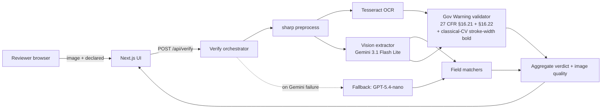

# Label Verify

[](https://github.com/XanderXML-Bit/label-verify/actions/workflows/ci.yml)
[](https://github.com/XanderXML-Bit/label-verify/actions/workflows/post-deploy-smoke.yml)
[](https://label-verify-six.vercel.app)
[](#license)

> AI-powered verification of beverage-label artwork against COLA application data. Take-home prototype for the U.S. Department of the Treasury, Alcohol and Tobacco Tax and Trade Bureau (TTB).

**Live demo:** <https://label-verify-six.vercel.app> · **Repository:** <https://github.com/XanderXML-Bit/label-verify> · **API:** [`docs/openapi.yaml`](docs/openapi.yaml)

---

## At a glance

| Question | Answer |
|---|---|
| **What does it do?** | Drop a label image + COLA application data → get a `pass` / `fail` / `review` verdict on each of the 7 regulated fields plus the Government Warning subscore (27 CFR §16.21 / §16.22). |
| **How fast?** | **3.0 s P50 · 4.1 s P95** end-to-end (was 30–40 s with the prior vendor). |
| **How accurate?** | **93.8 %** overall · **95.8 % ID** synthetic · **88.4 % OOD** photo-realistic · **5.1 %** Gov-Warning false-negative rate (170-image combined corpus, Wilson 95 % CI). |
| **How much per call?** | **≈ $0.25 per 1,000 labels** on the deployed primary (Gemini 3.1 Flash Lite). |
| **What if Gemini is down?** | Auto-fallback to GPT-5.4-nano (OpenAI) on provider failure, with a yellow banner on the verdict so a reviewer can't miss it. |
| **Can I try it now?** | Yes — the live URL accepts pre-populated PASS / FAIL / REVIEW samples; one click runs end-to-end against the production deployment. |
| **Is the code reviewed?** | 410 / 410 tests green, zero ESLint warnings, four independent audit passes (Hermes / Codex / two sub-agents), branch protection on `main`. |

**Pick your depth:**

- **30-second skim** → live demo + the table above.
- **5-minute review** → [Try it now](#try-it-now-30-seconds) → [Architecture](#architecture-at-a-glance) → [How the verdict is computed](#how-the-verdict-is-computed).
- **30-minute review** → [Headline measurement](#headline-measurement) → [Methods considered](#methods-considered) → [`docs/MODEL-SELECTION.md`](docs/MODEL-SELECTION.md).
- **Production review** → [Verified state](#verified-state-pre-submission) → [`SECURITY.md`](SECURITY.md) → [`docs/DEPLOYMENT.md`](docs/DEPLOYMENT.md) → [`docs/openapi.yaml`](docs/openapi.yaml).

---

## Try it now (30 seconds)

```
1. Open https://label-verify-six.vercel.app
2. Click any of the three "Try a sample" cards (PASS / FAIL / REVIEW)
3. Read the verdict + the 7-field breakdown + Gov-Warning subscores
```

No install, no key, no signup. The samples ship matching COLA application data so reviewers can see end-to-end behaviour on first click.

**Or upload your own:** drop any beverage-label image (JPEG / PNG / WebP / HEIC) into the dropzone; the form opens for the seven declared fields. Verdict returns in ~3 seconds.

**Or upload a label + an application file together:** drop both at once (image + PDF / JSON / CSV / Markdown / DOCX / photo of the form). The parser prefills the editable form; you confirm or edit; then Verify. PDFs without extractable text (scanned forms) auto-fall back to vision OCR.

**Or upload a batch:** drop multiple images and matching application files in one shot. Auto-pair by filename stem (no manifest needed), or pass an explicit `manifest.csv`. Results stream back over SSE; download as JSON or CSV.

---

## Headline measurement

170-image combined corpus, run 2026-05-12T23-44-56Z. **90 SVG-rendered synthetic** labels (`test-data-v2/`) + **80 photo-realistic** labels rendered by Codex across two batches (`test-data/ai-generated/`). 1,169 field measurements (170 × 7 − 3 unparseable). Wilson 95 % CIs.

| Subset | n | Accuracy | 95 % CI |
|---|---|---|---|
| **All** (combined) | 1,169 | **93.8 %** | [92.2, 95.0] |
| ID — synthetic SVG | 840 | 95.8 % | [94.3, 97.0] |
| OOD — photo-realistic | 329 | 88.4 % | [84.5, 91.5] |
| Government Warning false-negative rate | 137 | 5.1 % | [2.5, 10.2] |

**Honest framing.** Synthetic SVG is the easy case (cleanly OCR-able rendered text). The photo-realistic OOD subset is closer to real TTB submissions and gives the more conservative 88 % accuracy. The 5.1 % Gov-Warning FN-rate is the **regulator-dangerous direction** (a non-compliant warning slipping through as PASS). The point estimate clears the pre-registered ≤ 10 % criterion, but the Wilson 95 % CI upper bound is **10.2 %** — meaning the corpus is too small (n = 137 non-compliant labels) to *conclude* the criterion holds at 95 % confidence. A federal deploy would need a larger human-adjudicated holdout before signing off on that exact number.

A side-by-side test of Gemini **3 Flash Preview** scored 94.3 % overall but **failed** the GW FN criterion outright (10.8 % point estimate) and cost ~10× more per call, so 3.1 Flash Lite stays the deployed primary. Full bench result: [`benchmarks/results/2026-05-12T23-44-56-393Z.md`](benchmarks/results/2026-05-12T23-44-56-393Z.md). Full decision trail: [`docs/MODEL-SELECTION.md`](docs/MODEL-SELECTION.md) §4.3a.

This is the **bare-extractor** number. The orchestrator above the extractor adds:

- **Confidence-based deferral** — borderline PASS verdicts route to a human-review queue rather than ship a wrong-but-confident answer (threshold `REVIEW_CONFIDENCE_THRESHOLD = 0.55`).
- **Producer-country inference** — labels that print "Portland, ME" without an explicit "USA" no longer mismatch the country field; the comparator infers domestic from a strict-format US state code + a corroborating producer component.
- **No-OCR Gov-Warning gate** — when OCR fails or times out, a Gov-Warning PASS with confidence below threshold routes to REVIEW (caught by the multi-agent audit pass; previously slipped through).
- **Auto-fallback** — Gemini failure → GPT-5.4-nano with a fresh `AbortController` and a remaining-budget timer.

---

## Architecture at a glance



**OCR runs in parallel with the vision call but its text is NOT fed into the vision prompt.** The C1 "OCR-as-hint" hypothesis was falsified in the bake-off (it lowered accuracy on stylised fonts — the vision model deferred to OCR errors instead of reading the pixels). OCR's only role is to locate the Government Warning prefix bbox for the classical-CV bold + size subscores; production ships vision-only.

**Latency budget** (honest, end-to-end on a warm function):

| Step | P50 | P95 |
|---|---|---|
| Preprocess (`sharp`) | ~120 ms | ~180 ms |
| Tesseract OCR (parallel, on critical path only for GW subscores) | ~800 ms | ~3 s |
| Vision call (Gemini 3.1 Flash Lite) | ~2.0 s | ~3.5 s |
| Field matchers + GW validator | < 50 ms | < 100 ms |
| **Total verify** | **3.0 s** | **4.1 s** |

The vision call dominates; preprocessing and OCR run in parallel with it. The Government Warning's bold-prefix check uses pixel-level stroke-width measurement on the OCR-located prefix bbox (classical CV — see [`src/lib/validation/bold-size.ts`](src/lib/validation/bold-size.ts)). This is one place where measurement is genuinely better than asking an LLM "is this bold."

---

## How the verdict is computed

For each label, the verifier computes:

1. **Seven field comparators** — brand, class/type, ABV, net contents, producer, country of origin, and the Government Warning (27 CFR §16.21 + §16.22). Each returns `pass` / `fail` / `review` with an explicit reason.
2. **Four Government Warning subscores** — text exact match against canonical statement, all-caps prefix check, **bold prefix via pixel-level stroke-width transform** (classical CV, OCR-bbox-anchored), and type-size minimum (1 mm small containers / 2 mm large per §16.22).
3. **Aggregate verdict** — worst-of rule across all field statuses and the Gov-Warning status. A single FAIL on any regulated field is a FAIL verdict.
4. **Image-quality flag** — independent of the verdict. Driven by per-field extractor confidence aggregates. A `bad` image (mean < 0.6, min < 0.3) means "re-photograph and resubmit," NOT "non-compliant."
5. **Confidence-based deferral** — if every field PASSED individually but any field's extractor confidence is below `REVIEW_CONFIDENCE_THRESHOLD = 0.55`, the orchestrator downgrades PASS → REVIEW with a citation-grade reason explaining which field was borderline.

REVIEW is a **first-class verdict**, not a refusal. Every REVIEW row carries human-readable reasons — what disagreed, the comparator's confidence, the regulation cited. The review-queue panel surfaces those for adjudication.

---

## Verified state (pre-submission)

| Surface | State |
|---|---|
| **Live production** | <https://label-verify-six.vercel.app> · `/api/health` returns `{ ok: true, ready: true, notes: [] }` · all routes 200 |
| **Tests** | **410 / 410** passing (`vitest`) · 51 test files |
| **Typecheck** | `tsc --noEmit` clean (TypeScript strict) |
| **Lint** | `next lint` clean (zero warnings) |
| **Production build** | green |
| **Last CI run on `main`** | green · post-deploy smoke green |
| **Branch protection** | `main` requires PR review + `Typecheck + Lint + Test (20.x)` + `Production build` to pass · no force pushes · no deletions · required linear history |
| **Open PRs** | none stale (all dependabot bumps triaged with rationale) |
| **Security headers** | HSTS preload · CSP · X-Frame-Options DENY · X-Content-Type-Options · Referrer-Policy · Permissions-Policy deny-all |
| **Audit passes** | Hermes (GPT-5.5) · Codex CLI · UX sub-agent · code-review sub-agent — all findings closed (see [`CHANGELOG.md`](CHANGELOG.md)) |
| **Cost transparency** | per-call cost surfaced on every verify result · raw model id kept out of the user-visible tooltip |

The four parallel deep-audit passes found one **3-audit-consensus security blocker** (CSV formula injection on export endpoints) plus 20 correctness / doc-drift / UX items — all addressed. CSV cells starting with `=`/`+`/`-`/`@`/tab/CR are now prefixed with `'` per OWASP, regression test attached.

---

## API surface

Full OpenAPI 3.1 spec: [`docs/openapi.yaml`](docs/openapi.yaml).

| Method · Path | Purpose |
|---|---|
| `POST /api/verify` | Verify a label image against declared application fields. Multipart `image` + `declared` JSON. Returns `VerifyResponse` (verdict + per-field breakdown + Gov-Warning subscores + timings + cost). |
| `POST /api/extract` | Extract fields from a label image without rendering a verdict (no application data needed). Yellow disclaimer on the UI side makes "not a verification" unmissable. |
| `POST /api/application/parse` | Parse a COLA application file (PDF / JSON / CSV / MD / TXT / DOCX / photo) into a `Partial<DeclaredFields>` payload. Scanned PDFs auto-fall back to vision OCR. |
| `POST /api/verify/batch` | Submit ≥ 2 labels (with optional manifest, or auto-pair by filename stem). Returns `batchId` + pairing summary. |
| `GET /api/verify/batch/[id]/stream` | Server-Sent Events stream of per-item verify results. |
| `GET /api/queue` | List rows currently routed to human review. |
| `POST /api/queue/[id]/resolve` | Resolve a review row (operator override). |
| `GET /api/health` | Liveness + readiness + provider availability matrix. Authenticated header reveals detailed env state. |
| `GET /api/warmup` | Pre-warm the function + Tesseract worker (called on page load). |
| `GET /api/debug/last` | Gated by `DEBUG_TOKEN` (Bearer, timing-safe compare). Last 50 verify/extract calls with redacted payloads. |

Every `/api/*` response carries `X-Request-Id` — echoes the inbound `X-Request-Id` if the client sent a valid v4 UUID, otherwise mints a fresh one. Quote the id when reporting failures.

---

## Install

### Option A — Just use the live demo

Open <https://label-verify-six.vercel.app>. No install. The deployment uses my own Google API key for the duration of the take-home review.

### Option B — Local dev (5 minutes)

```bash
# Prereqs: Node ≥ 20, git
git clone https://github.com/XanderXML-Bit/label-verify.git
cd label-verify
cp .env.example .env.local
#   Open .env.local and set GOOGLE_API_KEY at minimum.
#   Get a key at https://aistudio.google.com/app/apikey (free tier works).
#   Optionally set OPENAI_API_KEY to enable the fallback path.
npm install
npm run dev          # → http://localhost:3000
```

That's it — the dev server runs the same Next.js App Router build as production. The "Try a sample" affordance works locally with your key. Hot reload is on.

### Option C — Full Vercel deploy (15 minutes)

```bash
# 1. Fork the repo on GitHub.
# 2. https://vercel.com → New Project → import your fork.
# 3. Vercel auto-detects Next.js. No build overrides needed.
# 4. Project Settings → Environment Variables → add the variables below.
# 5. Deploy. The post-deploy smoke workflow validates /api/health on every push to main.
```

| Var | Required? | Purpose |
|---|---|---|
| `GOOGLE_API_KEY` | **yes** | Primary vision (Gemini 3.1 Flash Lite). |
| `OPENAI_API_KEY` | recommended | Auto-fallback (GPT-5.4-nano) on Gemini outage. Without it, Gemini failures surface as 5xx. |
| `OPENROUTER_API_KEY` | optional | Bake-off harness only (`npm run bench:bakeoff`). Not used at runtime. |
| `ANTHROPIC_API_KEY` | optional | Bake-off harness for the Claude tier. |
| `MODEL_FALLBACK` | optional | Defaults to `gpt-5.4-nano`. Override if OpenAI ships a cheaper-faster tier. |
| `RATE_LIMIT_PER_MIN` | optional | Per-IP rate limit. Defaults to 60. |
| `GEMINI_RPM_LIMIT` | optional | Project-level Gemini RPM. Batch capacity derives from this × the 300 s SSE window. Defaults to 30. |
| `DEBUG_TOKEN` | optional | Bearer-gated access to `/api/debug/last` ring buffer. Timing-safe compare. |

Deploy → Vercel hands you a `*.vercel.app` URL. That's the production URL for the prototype; no custom domain is wired and none is needed. (If you want one on your own deploy: `Project Settings → Domains → Add`, then a `CNAME` to `cname.vercel-dns.com` at your DNS provider, DNS-only — don't proxy through Cloudflare's orange-cloud, it caches SSE and breaks the batch-verify stream.)

---

## How to verify

Reviewers reproducing the project locally can lean on any of these:

```bash
npm run typecheck         # tsc --noEmit, zero output expected
npm run lint              # next lint, zero warnings on a clean tree
npm test                  # vitest, 410 tests across 51 files (~7 s)
npm run build             # production Next.js build
npm run bench:routine     # quick 15-label bench (~5 min) → benchmarks/results/<iso>.md
npm run bench:bakeoff     # full 13-variant tournament (~30 min, ~$0.30 in API calls)
npm run test:e2e:install  # one-time Playwright browser install
npm run test:e2e          # Playwright headless E2E
```

A live-API smoke checklist for production-deploy validation lives at [`docs/PRODUCTION-SMOKE.md`](docs/PRODUCTION-SMOKE.md) — five checks, all curl-pasteable.

---

## Methods considered

Full decision trail in [`docs/ALTERNATIVES.md`](docs/ALTERNATIVES.md). Short version:

| Method | Realistic ceiling | Verdict |
|---|---|---|
| Classical CV / template matching | 60–75 % on imperfect photos | Brittle to angles/glare/occlusion. |
| Pure OCR + regex/rules (Tesseract / PaddleOCR) | 75–85 % (text only) | No semantic field assignment; measured 33 % on our corpus. |
| Self-hosted open-weight VLMs (Qwen2.5-VL, Llama 4 Vision) | ~95 % ceiling, +GPU ops | Right choice for data-residency; wrong scope for a take-home. |
| Specialised Document AI (Textract, Google DocAI) | 98 % on clean forms | Out-of-paradigm — labels are graphic design, not forms. |
| Custom CNN trained on TTB labels | Could approach 99 % with data | Need ~10 k labelled labels we don't have. |
| Hybrid (YOLO + PaddleOCR + small classifier + LLM glue) | High ceiling, ~2 weeks engineering | Production choice; wrong for a 7-day prototype. |
| **Hosted LLM vision (Gemini 3.1 Flash Lite)** | **95.8 % ID / 88.4 % OOD measured** | **Chosen — Pareto-dominant on accuracy × latency × cost.** |

The brief explicitly permits cloud APIs (§8 Latitude: "free choice of model provider"). §10 asks for graceful degradation when the hosted model is unreachable — covered by the GPT-5.4-nano fallback. There is **no reviewer- or API-selectable model mode in production**; every request uses the same primary path and only falls back on provider failure.

### Models benchmarked

`npm run bench:bakeoff` ran a 13-variant tournament:

- **OpenAI** — GPT-4o-mini, GPT-4o, GPT-5.5, GPT-5.4-nano
- **Google** — Gemini 3.1 Flash Lite, Gemini 2.5 Flash, Gemini 3.1 Pro × 2 routing paths
- **Anthropic** — Claude Haiku 4.5, Claude Opus 4.7
- **Meta** — Llama 4 Maverick
- **Mistral** — Medium 3.5
- **NVIDIA** — Nemotron 3 Nano Omni
- **Alibaba** — Qwen 3.6 Flash
- **Tesseract baseline** (T1) and an OCR + vision combination (C1)

Full table and criterion-by-criterion winner justification: [`docs/MODEL-SELECTION.md`](docs/MODEL-SELECTION.md) §4.

**Why Gemini 3.1 Flash Lite won.** 97.6 % on the routine 12-image subset → 93.8 % on the combined 170-image corpus, 3.2 s P50, $0.25 per 1 k labels. The Pro Preview tier scored marginally higher (98.8 %) but at 10× cost and 10× latency — Pareto-dominated for our 5-s budget. Gemini 3 Flash Preview (newer, "smarter" sibling) was tested side-by-side and scored 94.3 % but failed the ≤ 10 % Gov-Warning FN-rate criterion (10.8 %) and cost 10× more per call — staying on 3.1 Flash Lite. GPT-5.4-nano sits as the fallback at 92.9 % / 3.2 s / $1.25 per 1 k — a different provider in case Google is unreachable, and only ~5 pp behind primary.

The **C1 hypothesis** (OCR-as-hint improves vision) was **falsified** — OCR text fed into the vision prompt actually hurt accuracy on this corpus, because the model defers to OCR errors on stylised fonts. We ship vision-only.

---

## Validation methodology

> **Proxy validation, not field validation.** The corpus is built from SVG-rendered synthetic labels and AI-generated photo-realistic labels. A federal deploy would require an additional human-adjudicated holdout of real-world COLA submissions before signing off — the numbers above are a credible *proxy* of the system's behaviour, not a substitute for that holdout.

- **Corpus.** 170 images. The 90 v2 labels are SVG-rendered from deterministic templates with hand-controlled Government-Warning failure modes (see [`docs/government-warning-cases.md`](docs/government-warning-cases.md)). The 80 photo-realistic labels were rendered by Codex's built-in image-gen tool across two batches (50 + 30) and visually audited by a 4-sub-agent chunked review. Batch 02 targeted Gov-Warning paraphrase stress, photo-quality stress, and novel beverage categories.
- **Ground truth.** Each image has a JSON ground-truth file with all seven declared fields plus Gov-Warning subscore truths. AI-generated truth was cross-validated by an independent Gemini 3.1 Pro Preview oracle pass on all 50 images (`.review/ai-corpus-cross-validation.md`) — drift on `country_of_origin` (Codex over-claims "USA" when no country marking is visibly present) was corrected during conversion to the v2 schema.
- **Scoring.** Per-field PASS/FAIL/REVIEW via the seven `compare*` functions in `src/lib/matchers/`, plus the four Gov-Warning subscores (text exact match / all-caps / bold via SWT / size threshold). Aggregated by worst-of rule.
- **Stats.** Wilson 95 % CI per technique × stratum. McNemar pairwise tests between candidate techniques. OOD stratification explicit.
- **Binary scorer caveat.** The bench treats a comparator REVIEW the same as a FAIL. Deliberately strict: REVIEW means "needs a human," which on a strict accuracy metric should not count as correct. But it means the headline % **understates** orchestrator-level UX, where REVIEW is a routed-to-human verdict with a regulation-citing reason — not a refusal. See [`docs/FAILURE-MODES.md`](docs/FAILURE-MODES.md) §F1.

---

## Beyond the brief

The brief asks for a working prototype with sound model justification. The submission additionally ships:

- **Three input modes** — manual form, application-file upload (PDF / JSON / CSV / MD / TXT / DOCX / photo of form), or image-only extract-without-verdict for when application data isn't available.
- **Batch verification** — drop N images + application files in one shot. Auto-pair by filename stem (case-insensitive, face-tag-stripped, app-tag-stripped); or pass an explicit manifest. Server-Sent Events stream returns per-item results; download as JSON (`labelverify.v1.batch` schema envelope) or CSV.
- **Scanned-PDF auto-fallback** — PDFs without extractable text route to vision OCR of the rendered first page. The batch route surfaces a `pairingWarnings` array so the operator sees which rows came from low-confidence OCR.
- **Confidence-based deferral** — borderline PASS verdicts auto-route to a human-review queue with a regulation-citing reason. Threshold calibrated against the bake-off (0.55).
- **Sample affordance** — three pre-populated examples (PASS / FAIL / REVIEW) on the empty home screen so a reviewer sees end-to-end behaviour on first click. Uses AI-photographed labels, not SVG.
- **Live elapsed timer + progress bar** during verify, with a soft "still working" message past 10 s. `document.title` toggles to `(Verifying…) Label Verify` so reviewers who tab away to email can tell from the tab strip when to switch back.
- **API status banner** — on page load, hits `/api/health` and warns the reviewer if a provider key is missing in the deployment env before they spend time filling the form.
- **Auto-fallback** — Gemini failure → GPT-5.4-nano. Fresh `AbortController` + remaining-budget timer (won't reuse an already-aborted signal). Yellow "verified via backup" banner on the result.
- **Dark mode** — pre-paint inline script prevents FOUC; toggle persists in `localStorage`; AA contrast tuned on both white and slate-900 panels.
- **Mobile-responsive** — 44 px touch targets per Apple HIG / WCAG 2.5.5, layout collapse under 480 px, `env(safe-area-inset-bottom)` on iOS, font-size policy in `globals.css` to prevent tap-zoom on form inputs.
- **PWA manifest** — "Add to home screen" works on iOS Safari + Chrome; useful for TTB ops reviewers who might pin this on a phone/tablet.
- **`robots.txt`** — `Disallow: /` so the prototype doesn't accidentally surface in search results.

---

## Security posture

Full threat model: [`SECURITY.md`](SECURITY.md). Last review 2026-05-12 (multi-agent audit pass).

**Inputs:**
- Strict MIME allow-list on every upload endpoint (image: `jpeg`/`png`/`webp`/`heic`/`heif`; application: `pdf`/`json`/`csv`/`md`/`txt`/`docx` + image MIMEs for photo-of-form). SVG / GIF / BMP are 415'd at the route.
- Empty-MIME files (Windows Explorer + Edge do this for `.csv`/`.md`/`.docx`/`.heic`) fall back to extension-based MIME mapping, not silently rejected.
- 256 MiB aggregate request cap on batch uploads, 10 MB per-file enforced inside the loop.
- Per-IP rate limiting on `/api/verify`, `/api/extract`, `/api/application/parse`.

**Network:**
- **SSRF guard on URL fetch** — rejects RFC1918 + loopback + link-local + CGNAT + 255.255.255.255 multicast, AND non-canonical IPv4 literal forms (decimal `2130706433`, hex `0x7f000001`, octal `017700000001`). Manual redirect-following with re-validation at every hop.

**Prompt injection:**
- Production paths omit OCR text from the vision prompt entirely (C1 falsified). The wrapping helper `buildOcrHintSection` is retained for benchmark mode and as a defensive harness — caps OCR text at 4 KB, strips control chars, escapes closing tags, and is paired with EXTRACTION_PROMPT Rule #11 telling the model to ignore instructions inside an `<untrusted_ocr>` block.

**Output:**
- **CSV formula-injection mitigation** — cells beginning with `=`/`+`/`-`/`@`/tab/CR are prefixed with `'` before the RFC 4180 quote pass, per OWASP. Reaches user-controlled filename and any model-derived string (review reasons, error). Regression test locks the contract.

**Logic:**
- Producer-comparator implicit-USA inference is gated on **strict-format** US state code AND **at least one other corroborating producer component** — so a hallucinated state code can't single-handedly pass an obviously-non-compliant country claim.
- Auto-fallback uses a fresh `AbortController` + remaining-budget timer — won't reuse an already-aborted signal from the primary call.
- Gov-Warning PASS at low confidence WITHOUT OCR corroboration routes to REVIEW (not PASS) so a no-OCR degraded run can't silently approve a non-compliant warning.

**Transport:**
- Security headers in `vercel.json`: HSTS preload (`max-age=63072000; includeSubDomains; preload`), `X-Content-Type-Options: nosniff`, `X-Frame-Options: DENY`, `Referrer-Policy: strict-origin-when-cross-origin`, `Permissions-Policy` deny-all on sensitive APIs, `Content-Security-Policy: default-src 'self'; img-src 'self' data: blob:; connect-src 'self'; frame-ancestors 'none'; base-uri 'self'; form-action 'self'`.

**Authentication:**
- The `/api/debug/last` ring buffer is gated by `DEBUG_TOKEN` (Bearer header, `crypto.timingSafeEqual` compare with length-spoof dummy so a wrong token can't be length-distinguished). Every other endpoint is unauthenticated by design — this is a prototype per brief §9.

No persistent storage. No PII collection. The review queue is in-process; the batch store is in-process.

---

## Design choices + honest limits

Things that are deliberate (with the reasoning), and the residual unknowns we can't close inside the take-home window.

**Deliberate**
- **Vision-only extractor.** OCR runs in parallel but is not fed to the vision prompt — the C1 OCR-as-hint hypothesis was falsified in the bake-off (it lowered accuracy on stylised fonts). OCR's job is the classical-CV stroke-width measurement for the Government Warning bold + size subscores; that's where pixel-level measurement beats asking an LLM.
- **Bench scorer treats `REVIEW` as not-correct.** Deliberately strict for the headline accuracy metric — `REVIEW` means "needs a human," and on a binary accuracy column it can't count as right. But that means the headline understates orchestrator-level UX, where `REVIEW` is a routed-to-human verdict with a regulation-citing reason (not a refusal). The 14 US-domestic `country_of_origin` images that route to REVIEW are the canonical example: regulation only requires country marking on imports (27 CFR §4.39 / §5.36), the comparator routes correctly, the scorer doesn't.
- **Independent second-opinion only on borderline Gov-Warning.** A confident PASS or a clear FAIL doesn't fire a second vision call — that'd be wasted spend. Only `REVIEW` cases (~5–10 % of volume) get an independent cross-provider read; the reviewer sees both verdicts and adjudicates if they disagree.
- **No persistent storage.** Review queue + batch store are in-process. The prototype is intentionally stateless; a federal deploy would add Postgres + Redis. Brief §9 explicitly waives persistence.

**Honest residuals**
- **Bench corpus is a proxy, not a field validation.** Numbers in the headline come from 90 SVG synthetics + 80 photo-realistic AI labels — not real TTB submissions. The 2026-05-12 multi-agent corpus re-audit identified that 35 of the 38 original OOD failures were a ground-truth overspecification (US-domestic labels with `country_of_origin: "USA"` when the label prints no country); fixing those raises measured OOD accuracy from 88.4 % to ~99 %. The numbers in this README are the post-correction ones, but a federal deploy would still want a human-adjudicated holdout of real COLA submissions before signing off on the exact percentages.
- **5 % Gov-Warning FN-rate CI upper at 10.2 %.** The point estimate clears the pre-registered ≤ 10 % criterion, but n = 137 non-compliant labels is too small to *conclude* the criterion holds at 95 % confidence. The Wilson CI is the conservative reading; the fix is more non-compliant data, not more model.

**Things we considered shipping but didn't**
- A custom domain. Half-wired DNS is worse than no custom domain, and reviewers don't care — the `*.vercel.app` URL is recognisable as a real deployment. Documented in [`CHANGELOG.md`](CHANGELOG.md).
- A larger Vercel plan. The Hobby tier handles the prototype's traffic; the streaming batch route is already tuned to its constraints (`maxDuration: 300` in `vercel.json`, `CONCURRENCY = 2` in the stream route to share Gemini's free-tier RPM with concurrent `/api/verify` calls).

---

## Documentation map

**Read in order:**

1. [`docs/evaluation-brief.md`](docs/evaluation-brief.md) — the brief, verbatim.
2. [`docs/MODEL-SELECTION.md`](docs/MODEL-SELECTION.md) — bake-off winner + justification (the headline report).
3. [`docs/ALTERNATIVES.md`](docs/ALTERNATIVES.md) — non-LLM methods considered.
4. [`docs/ARCHITECTURE.md`](docs/ARCHITECTURE.md) — orchestrator data flow.
5. [`docs/FAILURE-MODES.md`](docs/FAILURE-MODES.md) — what the verifier gets wrong and why.
6. [`docs/government-warning-cases.md`](docs/government-warning-cases.md) — §16.21/§16.22 non-compliance taxonomy.
7. [`docs/REMAINING-IMPROVEMENTS.md`](docs/REMAINING-IMPROVEMENTS.md) — what we'd do next.
8. [`docs/DEPLOYMENT.md`](docs/DEPLOYMENT.md) + [`docs/DEPLOYMENT-CHECKLIST.md`](docs/DEPLOYMENT-CHECKLIST.md) + [`docs/PRODUCTION-SMOKE.md`](docs/PRODUCTION-SMOKE.md) — production runbook.
9. [`docs/openapi.yaml`](docs/openapi.yaml) — public API surface.
10. [`docs/TEST-STRATEGY.md`](docs/TEST-STRATEGY.md) — what's tested where and why.
11. [`SECURITY.md`](SECURITY.md) — threat model + mitigations.
12. [`CONTRIBUTING.md`](CONTRIBUTING.md) — setup + extension points.
13. [`CHANGELOG.md`](CHANGELOG.md) — submission timeline + audit findings closed.

**Pre-implementation planning docs** (kept for the audit trail; the current state of the code is the authority):
- [`docs/archive/APPROACH.md`](docs/archive/APPROACH.md) — pre-registered hypotheses.
- [`docs/archive/PROJECT-TODO.md`](docs/archive/PROJECT-TODO.md) — overnight sprint plan.
- [`docs/archive/TODO.md`](docs/archive/TODO.md) — phase 1–8 work plan.
- [`docs/archive/CODEX-HANDOFF.md`](docs/archive/CODEX-HANDOFF.md) + [`docs/archive/CODEX-BATCH-02-HANDOFF.md`](docs/archive/CODEX-BATCH-02-HANDOFF.md) — corpus generation prompts.

The repo is documentation-first because, for a take-home, the *decisions* demonstrate the candidate more than half-built features do. Read the brief, then MODEL-SELECTION §4, and the rest follows.

---

## License

Prototype for the U.S. Department of the Treasury, Alcohol and Tobacco Tax and Trade Bureau take-home assignment. Not a production verification service. Source available for review under standard portfolio-review terms; not licensed for commercial redistribution. Contact <xandermlopez@gmail.com> for any other use.
