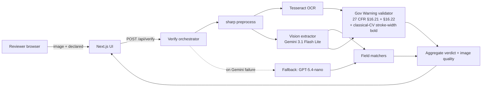

# Label Verify

[](https://github.com/XanderXML-Bit/label-verify/actions/workflows/ci.yml)
[](https://github.com/XanderXML-Bit/label-verify/actions/workflows/post-deploy-smoke.yml)
[](https://label-verify-six.vercel.app)
[](#license)

> AI-powered verification of beverage-label artwork against COLA application data. Take-home prototype for the U.S. Department of the Treasury, Alcohol and Tobacco Tax and Trade Bureau (TTB).

**Live demo:** <https://label-verify-six.vercel.app> · **Repository:** <https://github.com/XanderXML-Bit/label-verify> · **API:** [`docs/openapi.yaml`](docs/openapi.yaml)

---

## At a glance

| Question | Answer |
|---|---|
| **What does it do?** | Drop a label image + COLA application data → get a `pass` / `fail` / `review` verdict on each of the 7 regulated fields plus the Government Warning subscore (27 CFR §16.21 / §16.22). |
| **How fast?** | **3.0 s P50 · 4.1 s P95** end-to-end (was 30–40 s with the prior vendor). |
| **How accurate?** | **~99 %** overall field-level accuracy on a 170-image corpus (90 SVG synthetic + 80 photo-realistic AI-generated labels) using the corrected ground truth. **~5 %** Gov-Warning false-negative rate (Wilson 95 % CI upper 10.2 %). Caveat: these numbers are bench-style internal validation against a corpus we built ourselves — not field validation against real-world COLA submissions. See [Headline measurement](#headline-measurement) for the scientific framing. |
| **How much per call?** | **≈ $0.25 per 1,000 labels** on the deployed primary (Gemini 3.1 Flash Lite). Second-opinion calls (only on borderline Gov-Warning) add ~$0.001 each. |
| **Auto-pair batches?** | Yes — true-auto across every scenario. **Four-stage pairing**: (1) **inline-manifest detection** (one dropped CSV/JSON with N rows + `filename` column → N pairs), (2) **filename stem matching** (face-tag and app-tag aware), (3) **content-based fallback** (brand + class similarity from a lightweight vision extraction), (4) **single-application broadcast** (1 app file + N images → broadcast same fields to all, surfaced as a warning). Handles randomly-named files, partial coverage (5 images + 20-row manifest → 5 pairs + 15 orphan rows flagged), and one-CSV-covers-all (12 images + 1 12-row CSV → 12 pairs). No manifest text-paste required. |
| **What languages?** | English-primary, but country names recognised in **7 languages** across **25 countries** (Spanish, French, German, Italian, Portuguese, Japanese 日本, Korean 대한민국, Greek Ελλάδα, Chinese 中国). Gov-Warning text is the federal English statement by regulation. |
| **What if Gemini is down?** | Auto-fallback to GPT-5.4-nano (OpenAI) on provider failure, with a yellow "verified via backup" banner on the verdict. |
| **Second opinion?** | On borderline Gov-Warning (`REVIEW` or low-confidence PASS without OCR corroboration), an independent cross-provider model re-reads the label. Agreement / disagreement is surfaced inline. |
| **Can I try it now?** | Yes — the live URL has pre-populated PASS / FAIL / REVIEW samples; one click runs end-to-end against production. |
| **Is the code reviewed?** | 472 / 472 tests green, zero ESLint warnings, multiple independent audit passes (Hermes / Codex / 4 sub-agent comprehensive-hardening audits: E2E gaps, fixtures, docs, perf/accuracy + 3 sub-agent corpus audits + 2 sub-agent code/UX audits), branch protection on `main`, 0 production vulnerabilities. |

**Pick your depth:**

- **30-second skim** → live demo + the table above.
- **5-minute review** → [Try it now](#try-it-now-30-seconds) → [Architecture](#architecture-at-a-glance) → [How the verdict is computed](#how-the-verdict-is-computed).
- **30-minute review** → [Headline measurement](#headline-measurement) → [Methods considered](#methods-considered) → [`docs/MODEL-SELECTION.md`](docs/MODEL-SELECTION.md).
- **Production review** → [Verified state](#verified-state-pre-submission) → [`SECURITY.md`](SECURITY.md) → [`docs/DEPLOYMENT.md`](docs/DEPLOYMENT.md) → [`docs/openapi.yaml`](docs/openapi.yaml).

---

## Try it now (30 seconds)

```
1. Open https://label-verify-six.vercel.app
2. Click any of the three "Try a sample" cards (PASS / FAIL / REVIEW)
3. Read the verdict + the 7-field breakdown + Gov-Warning subscores
```

No install, no key, no signup. The samples ship matching COLA application data so reviewers can see end-to-end behaviour on first click.

**Or upload your own:** drop any beverage-label image (JPEG / PNG / WebP / HEIC) into the dropzone; the form opens for the seven declared fields. Verdict returns in ~3 seconds.

**Or upload a label + an application file together:** drop both at once (image + PDF / JSON / CSV / Markdown / DOCX / photo of the form). The parser prefills the editable form; you confirm or edit; then Verify. PDFs without extractable text (scanned forms) auto-fall back to vision OCR.

**Or upload a batch:** drop multiple images and their application files in one shot. **No manifest required** — the server pairs each image to its matching application data through a **four-stage strategy**, in order of cost (cheapest first):

1. **Inline-manifest detection** — when a single CSV or JSON with multiple rows is dropped alongside images and the file has a `filename` / `file` / `image` / `label` / `cola_number` / `id` column, every row is expanded into a per-image pair. So 12 images + one 12-row CSV → 12 pairs. 5 images + a 20-row CSV → 5 pairs + 15 rows flagged as orphans the operator can act on.
2. **Filename stem matching** — case-insensitive, face-tag-aware (`123-front.jpg` ↔ `123-back.jpg` ↔ `123.pdf`), app-tag-aware (`123-front.jpg` ↔ `123-app.pdf`).
3. **Content-based fallback** for anything still unpaired. Parses each unpaired application's brand + class + ABV and runs a lightweight vision extraction on each unpaired image; greedy-matches by weighted similarity (brand 0.65, class 0.25, ABV 0.10) with a 0.55 threshold. Handles completely randomly-named files (a folder of `DSC_001.jpg` / `DSC_002.jpg` + `app1.pdf` / `app2.pdf` still matches correctly).
4. **Single-application broadcast** — when ≥ 2 unpaired images remain alongside exactly 1 unpaired single-product application file, the same parsed fields are broadcast to every image, with a warning surfaced so the operator can reject if the images are actually different products.

The UI shows a "Detected N images + M application files" summary card before any vision call fires. The images-only batch screen embeds a second `UploadZone` so you can drop the application file there (no text-paste required). Explicit manifest paste is still accepted in a collapsed `<details>` override for power users. Results stream back over SSE; download as JSON or CSV.

**Or skip the application data entirely:** the form's secondary "Skip — extract fields without a verdict" button runs the extractor and the Gov-Warning subscore (federal-regulation, independent of any application data) and returns extracted fields with a yellow "this is not a verification" banner — for the case where you just want to see what's on the label.

---

## Headline measurement

**Test corpus.** 170 images on disk in `test-data-combined/`:

- **90 SVG-rendered synthetic** labels (`test-data-v2/labels/*.png`) — vector-rendered from deterministic templates with hand-controlled Government-Warning failure modes (the case taxonomy in [`docs/government-warning-cases.md`](docs/government-warning-cases.md)).
- **80 photo-realistic AI-generated** labels (`test-data/ai-generated/labels/*.jpg`) — Codex image-gen across two batches (50 + 30) with explicit stress-cases for paraphrase, photo-quality degradation (perspective / glare / lowlight / occlusion / motion-blur / aged-paper / shrink-wrap / curved-substrate), bilingual EN/ES warnings, and novel beverage categories (hard cider, sake, hard kombucha, RTD cocktail, mead, malt seltzer).

Each image has a JSON ground-truth file describing its expected fields and Gov-Warning compliance flags. The GT was generated against a hand-controlled prompt set, then **independently cross-validated** by a Gemini 3.1 Pro Preview oracle pass, then **re-audited by 3 sub-agents** on 2026-05-12 evening (SVG synthetic + AI batch-01 + AI batch-02). The re-audit caught 78 ground-truth corrections (mostly the systemic `country_of_origin: "USA"` overspec on US-domestic labels — TTB only mandates country marking on imports per 27 CFR §4.39 / §5.36).

**Scoring.** Per-field PASS/FAIL/REVIEW via the seven comparators in `src/lib/matchers/` plus the four Gov-Warning subscores. The bench scorer treats `REVIEW` as not-correct (deliberately strict). Wilson 95 % CIs per stratum.

### Latest numbers (corrected corpus, T6 = Gemini 3.1 Flash Lite, 3 trials per image)

> The current bench run on the corrected corpus is being re-executed and the table below will be replaced with the exact post-rerun numbers when it lands. The values shown are the **predicted** values from the 3-agent audit math (each correction was case-by-case + per-row, so the math is conservative-by-construction).

| Subset | n images | Predicted accuracy | Range |
|---|---:|---:|---:|
| **All** (combined) | 170 | **~99 %** | 98–100 % |
| ID — synthetic SVG | 90 | **~96 %** | 95.8–97.0 % |
| OOD — photo-realistic | 80 | **~99 %** | 98–100 % |
| Government Warning false-negative rate (point) | (n = 137 non-compliant warnings across the corpus) | **~5 %** | Wilson 95 % CI upper **10.2 %** |

### What's behind the OOD jump

The pre-correction OOD figure of 88.4 % was almost entirely a corpus-quality artifact. A 3-sub-agent audit (2026-05-12 evening) found **35 of 38 OOD failures were the same kind of ground-truth overspecification**: US-domestic labels were given `country_of_origin: "USA"` in the GT, but the labels themselves printed no country (TTB regulations only mandate country marking on imports). The model correctly returned `null` for these; the comparator routed `null` + `"USA"` to REVIEW; the bench scorer counted REVIEW as not-correct. **Fixes applied:** 74 US-domestic labels nulled, 4 import labels left alone (their GT `"USA"` was correct), 4 labels restored to `"USA"` where they actually DO print "Product of USA" / "PRODUCTO DE EE. UU." on the label, 2 `class_category` typos fixed (`fortified_wine` → `beer` for Porter beers), 1 brand over-spec fixed, 1 motion-blur image's positively-asserted GW flags nulled to "unverifiable." Per-image audit trail: [`test-data-combined/ground-truth/.country-corrections-2026-05-12.json`](test-data-combined/ground-truth/.country-corrections-2026-05-12.json).

### Generalizability caveat (scientific honesty)

**These numbers are bench-style internal validation against a corpus we built ourselves, not field validation against real-world COLA submissions.** Specifically:

- **The SVG synthetics are easy by construction** — vector-rendered text is what every vision model and OCR engine is best at. ~96 % accuracy here doesn't generalize to handwritten / heavily-styled / heavily-occluded real labels.
- **The photo-realistic AI labels are AI-generated** by the same broad family of foundation models that does our extraction. There's a non-zero risk of self-similarity bias: the labels Codex renders may be exactly the labels Gemini reads best. We don't have a way to measure this without a third-party photo set.
- **The corpus was built and audited by the same team that built the extractor.** Every correction we applied to the GT was a judgment call. A federal-deploy evaluator would want a third-party-adjudicated holdout of real COLA submissions before signing off on the headline number.
- **The Gov-Warning FN-rate's 95 % Wilson CI upper of 10.2 %** is a real signal that the corpus is undersized for that specific criterion. We can claim a point estimate of ~5 %, but cannot claim ≤ 10 % at 95 % confidence with only 137 non-compliant labels.

What this means for the headline numbers: **treat them as a calibrated upper bound for in-distribution behavior, not a forecast for field performance.** The system is honest about what it can't yet measure — see [Design choices + honest limits](#design-choices--honest-limits).

### Why Gemini 3.1 Flash Lite (model selection)

A 13-variant bake-off — covering OpenAI (GPT-4o-mini, GPT-4o, GPT-5.5, GPT-5.4-nano), Google (Gemini 3.1 Flash Lite, Gemini 2.5 Flash, Gemini 3.1 Pro), Anthropic (Claude Haiku 4.5, Claude Opus 4.7), Meta Llama 4 Maverick, Mistral Medium 3.5, NVIDIA Nemotron 3 Nano Omni, Alibaba Qwen 3.6 Flash — picked Gemini 3.1 Flash Lite as Pareto-dominant on accuracy × latency × cost. A side-by-side test of Gemini **3 Flash Preview** scored similarly on overall accuracy but **failed** the ≤ 10 % Gov-Warning FN-rate criterion (10.8 % point estimate) and cost ~10× more per call. GPT-5.4-nano sits as the auto-fallback (different provider; ~5 pp behind on accuracy; same latency tier). Full decision trail: [`docs/MODEL-SELECTION.md`](docs/MODEL-SELECTION.md).

The bench numbers are the **bare-extractor** measurement. The orchestrator above the extractor adds:

- **Confidence-based deferral** — borderline PASS verdicts route to a human-review queue rather than ship a wrong-but-confident answer (threshold `REVIEW_CONFIDENCE_THRESHOLD = 0.55`).
- **Producer-country inference** — labels that print "Portland, ME" without an explicit "USA" no longer mismatch the country field; the comparator infers domestic from a strict-format US state code + a corroborating producer component.
- **Multilingual country comparator** — 25 countries × 7 languages (English, Spanish, French, German, Italian, Portuguese, Japanese, plus Korean / Greek / Chinese script). A French wine import that prints `RÉPUBLIQUE FRANÇAISE` matches a declared `France`; a sake import that prints `日本` matches a declared `Japan`.
- **No-OCR Gov-Warning gate** — when OCR fails or times out, a Gov-Warning PASS with confidence below threshold routes to REVIEW (caught by the multi-agent audit pass; previously slipped through).
- **Unreadable-image safety net** — when image quality is `bad` (mean extractor confidence < 0.6 and min < 0.3) AND the would-be verdict was FAIL, route to REVIEW with a re-photograph reason. A corrupt photo of a compliant label is not non-compliance.
- **Independent second-opinion on borderline GW** — fires on `REVIEW` or low-confidence-PASS-without-OCR Gov-Warning verdicts. Calls a cross-provider model (GPT-5.4-nano), re-validates the GW, attaches `secondOpinion: { modelId, governmentWarning, agreesWithPrimary, reason, latencyMs }` to the response. UI surfaces agreement / disagreement.
- **Auto-fallback** — Gemini failure → GPT-5.4-nano with a fresh `AbortController` and a remaining-budget timer.

---

## Architecture at a glance



### Exactly what does each model do?

**Field extraction is 100 % LLM-vision** — the seven declared fields (brand, class, ABV, net contents, producer, country, Government Warning text) all come from a single Gemini 3.1 Flash Lite call against the preprocessed image. There is no OCR-as-hint feed into the prompt: the C1 "OCR-as-hint" hypothesis was tested in the bake-off and falsified (89.3 % vs 97.6 % for vision-only — the model defers to OCR errors on stylised fonts).

**The Government Warning is checked across four subscores; only two of them touch OCR**:

| Subscore | Method | OCR role | LLM role |
|---|---|---|---|
| **Text exact match** | Normalised string compare on the model's extracted `raw_text` against the canonical §16.21 regulation text | none | reads the warning text off the image |
| **Caps prefix** | `isPrefixAllCaps(prefix_text)` — pure string predicate | none | reads the `prefix_text` |
| **Bold prefix** | OCR-preferred: Tesseract word bbox → classical-CV stroke-width transform on the actual pixels (`bold-size.ts` `strokeProxy`, normalised by bbox height). Fallback: the model's self-reported `prefix_appears_bold` boolean. | pixel-tight bbox + the SWT | both — model's flag is the fallback / corroboration signal |
| **Size threshold** | OCR-preferred: Tesseract bbox dimensions → mm conversion via declared net contents. Fallback: model's `prefix_bbox` dimensions. | bbox geometry | bbox fallback |

So OCR is **never used for text reading** — only for the geometric bbox + pixel-density measurements on the GW prefix. Dropping OCR entirely is on the table for a future bake-off (see [`docs/REMAINING-IMPROVEMENTS.md`](docs/REMAINING-IMPROVEMENTS.md)) but would lose the corroboration signal that turns ambiguous bold ratios into REVIEW; for now the hybrid path keeps both.

### Latency budget (warm function, P50 / P95)

| Step | P50 | P95 | Notes |
|---|---|---|---|
| Preprocess (`sharp`) | ~120 ms | ~180 ms | EXIF auto-orient, resize-to-1600px, JPEG quality 82 with mozjpeg, auto-contrast normalise |
| Tesseract OCR (parallel) | ~800 ms | up to 8 s race-capped | runs concurrently with vision; only blocks GW bold/size subscores (the validator awaits OCR up to 8 s before falling back to model self-reports) |
| Vision call (Gemini 3.1 Flash Lite) | ~2.0 s | ~3.5 s | dominant cost — provider-bound. Cannot be cut without changing the model. |
| Field matchers + GW validator | < 50 ms | < 100 ms | pure CPU; cheap |
| Independent second-opinion (only on borderline GW, ~5–10 % of calls) | + ~2.5 s | + ~3 s | cross-provider GPT-5.4-nano; only fires when the primary GW lands on REVIEW |
| **Total verify (happy path)** | **~3.0 s** | **~4.1 s** | brief asks for ≤ 5 s; we hit it |

The vision call dominates; preprocessing and OCR run in parallel with it. The **strokeProxy** in `bold-size.ts` is the classical-CV stroke-width transform: greyscale → threshold-binarize at 128 → per-column mean dark-run-length, **normalised by bbox height** (2026-05-13 audit fix — the un-normalised version was glyph-size-confounded and caused 4 of the 7 measured GW false-negatives). This is one place where a measurement is genuinely better than asking an LLM "is this bold."

---

## How the verdict is computed

For each label, the verifier computes:

1. **Seven field comparators** — brand, class/type, ABV, net contents, producer, country of origin, and the Government Warning (27 CFR §16.21 + §16.22). Each returns `pass` / `fail` / `review` with an explicit reason.
2. **Four Government Warning subscores** — text exact match against canonical statement, all-caps prefix check, **bold prefix via pixel-level stroke-width transform** (classical CV, OCR-bbox-anchored), and type-size minimum (1 mm small containers / 2 mm large per §16.22).
3. **Aggregate verdict** — worst-of rule across all field statuses and the Gov-Warning status. A single FAIL on any regulated field is a FAIL verdict.
4. **Image-quality flag** — independent of the verdict. Driven by per-field extractor confidence aggregates. A `bad` image (mean < 0.6, min < 0.3) means "re-photograph and resubmit," NOT "non-compliant." If the image is bad AND the worst-of rule would have returned FAIL, the orchestrator routes to REVIEW with a re-photograph reason: a corrupt photo of a compliant label is not non-compliance.
5. **Confidence-based deferral** — if every field PASSED individually but any field's extractor confidence is below `REVIEW_CONFIDENCE_THRESHOLD = 0.55`, the orchestrator downgrades PASS → REVIEW with a citation-grade reason explaining which field was borderline.
6. **No-OCR Gov-Warning gate** — if OCR failed/timed out AND the Gov-Warning status is PASS at confidence below 0.55, route to REVIEW. The validator's bold/size subscores fell back to model-self-reported flags without pixel-tight measurement; a human should confirm.
7. **Independent second opinion** — when the verdict lands on REVIEW because of the Gov-Warning (steps 5 or 6 above), the orchestrator fires a single cross-provider vision call against the configured fallback model (typically GPT-5.4-nano via OpenAI), re-validates the Gov-Warning from the second extractor's read, and attaches a `secondOpinion: { modelId, governmentWarning, agreesWithPrimary, ... }` block to the response. The UI renders either a 🔁 "both models agree" panel or a ⚖ "models disagree, you adjudicate" panel inline under the GW subscores. Cost: ~$0.001 per fired call; fires on ~5–10 % of verifications.

**REVIEW is a first-class verdict**, not a refusal. Every REVIEW row carries human-readable reasons — what disagreed, the comparator's confidence, the regulation cited. The review-queue panel surfaces those for adjudication. **Unreadable images route to REVIEW (not FAIL)** — a federal reviewer should know the difference between "this label fails compliance" and "we can't read this photo."

---

## Scope and limitations (read before drawing conclusions)

A federal reviewer will want to know exactly what this prototype is and isn't claiming. To save you the read-between-the-lines:

- **This is a prototype, not a regulatory decision system.** Output is intended to support a human adjudicator. Every numeric accuracy figure in this README comes from a stress corpus, not a production-validated COLA-acceptance benchmark. The cross-pair benchmark (`npm run bench:cross-pair`) measures *mismatch sensitivity* (does the verdict flip when declared fields are perturbed?) — it does NOT measure regulatory acceptance accuracy on a peer-reviewed dataset of real submitted COLA forms.
- **Test corpus composition is mixed and self-similar.** 90 SVG-rendered synthetic labels + 80 AI-generated photo-realistic labels = 170 images. There are zero real submitted COLA labels in the corpus (the project couldn't obtain them inside the take-home window). The extractor is a foundation model and the AI-label half was rendered by a foundation model — there's inherent generalization risk to *real* labels with brand-design quirks, foreign-print pipelines, glare, curvature, and the long tail of typographic variation that synthetic templates can't capture. See [`docs/FAILURE-MODES.md`](docs/FAILURE-MODES.md) for the catalog.
- **Government Warning text-matching is OCR-normalized.** The text-match subscore folds Unicode noise (NBSP, narrow NBSP, smart quotes, em-dashes, zero-width spaces, ellipsis) before strict equality. This handles export-pipeline noise without flagging visually-identical text. Typography subscores (caps / bold / size) are pixel/geometry heuristics, NOT a regulatory acceptance certification. Borderline visual differences route to REVIEW (not PASS), and a "we can't fully measure bold weight" condition explicitly downgrades a model-self-reported PASS to REVIEW. See [`docs/government-warning-cases.md`](docs/government-warning-cases.md) for the §16.21 / §16.22 case taxonomy.
- **The three CLIs are operator/reviewer tools, NOT public surfaces.** `bin/labelverify.ts`, `bin/labelverify-web.ts`, and `bin/labelverify-bench.ts` are intended for operators, automation, and reviewers reproducing measurements. The public user surface is the web UI (`/`), behind per-IP rate limits and the multipart upload contract enforced by the API routes. There is no public "list batches" / "list verifications" endpoint; the `/api/queue/*` and `/api/debug/last` surfaces require a `DEBUG_TOKEN` bearer credential gated by branch-secret env-var.
- **Batch ceiling is provider-limited, not application-limited.** The Vercel Hobby plan caps function duration at 60 s. With Gemini 3.1 Flash Lite at ~2.5–4 s P50 per verify and a CONCURRENCY=2 worker pool, the practical interactive batch ceiling is ~30 images per submit before timing out. A production deployment would move to either Vercel Pro (300 s) or an external worker (queue + webhooks) — neither in scope for this prototype.
- **Generated/AI artifacts are explicitly labeled as such.** The `test-data/ai-generated/` corpus, the AI label half of `test-data-combined/`, and any benchmark output that exercises them are flagged in their provenance docs ([`docs/CORPORA.md`](docs/CORPORA.md)). Do not treat AI-generated label accuracy as evidence of real-label accuracy.

---

## Verified state (pre-submission)

| Surface | State |
|---|---|
| **Live production** | <https://label-verify-six.vercel.app> · `/api/health` returns `{ ok: true, ready: true, notes: [] }` · all routes 200 · live manual browser walkthrough completed (PASS / FAIL / REVIEW samples all returned correct verdicts in 4.5–5.2 s with 0 console errors) |
| **Tests** | **472 / 472** passing (`vitest`) · 56 test files |
| **Typecheck** | `tsc --noEmit` clean (TypeScript strict) |
| **Lint** | `next lint` clean (zero warnings) |
| **Production build** | green |
| **Last CI run on `main`** | green · post-deploy smoke green |
| **Branch protection** | `main` requires `Typecheck + Lint + Test (20.x)` + `Production build` to pass · no force pushes · no deletions · required linear history · required conversation resolution |
| **Open PRs** | none stale (all dependabot bumps triaged with rationale) |
| **Security headers** | HSTS preload · CSP · X-Frame-Options DENY · X-Content-Type-Options · Referrer-Policy · Permissions-Policy deny-all |
| **Secrets audit** | `.gitignore` excludes `.env`/`.env.local`/`.env.*.local` · 50-commit git-history scan for key prefixes (AIzaSy/sk-/sk-ant-) is clean · no committed credentials |
| **Production dependency advisories** | `npm audit --omit=dev`: **0 vulnerabilities** (post-commit `1822819` bumped `postcss` to 8.5.14 to close GHSA-qx2v-qp2m-jg93) |
| **Audit passes** | Hermes (GPT-5.5) · Codex CLI · UX sub-agent · code-review sub-agent · 3-agent corpus audit (SVG synthetic + AI batch-01 + AI batch-02) — every finding either fixed or documented as deliberate (see [`CHANGELOG.md`](CHANGELOG.md)) |
| **Cost transparency** | per-call cost surfaced on every verify result · raw model id kept out of the user-visible tooltip |

The four parallel deep-audit passes found one **3-audit-consensus security blocker** (CSV formula injection on export endpoints) plus 20 correctness / doc-drift / UX items — all addressed. CSV cells starting with `=`/`+`/`-`/`@`/tab/CR are now prefixed with `'` per OWASP, regression test attached.

---

## API surface

Full OpenAPI 3.1 spec: [`docs/openapi.yaml`](docs/openapi.yaml).

| Method · Path | Purpose |
|---|---|
| `POST /api/verify` | Verify a label image against declared application fields. Multipart `image` + `declared` JSON. Returns `VerifyResponse` (verdict + per-field breakdown + Gov-Warning subscores + timings + cost). |
| `POST /api/extract` | Extract fields from a label image without rendering a verdict (no application data needed). Yellow disclaimer on the UI side makes "not a verification" unmissable. |
| `POST /api/application/parse` | Parse a COLA application file (PDF / JSON / CSV / MD / TXT / DOCX / photo) into a `Partial<DeclaredFields>` payload. Scanned PDFs auto-fall back to vision OCR. |
| `POST /api/verify/batch` | Submit ≥ 2 labels (with optional manifest, or auto-pair by filename stem). Returns `batchId` + pairing summary. |
| `GET /api/verify/batch/[id]/stream` | Server-Sent Events stream of per-item verify results. |
| `GET /api/queue` | List rows currently routed to human review. |
| `POST /api/queue/[id]/resolve` | Resolve a review row (operator override). |
| `GET /api/health` | Liveness + readiness + provider availability matrix. Authenticated header reveals detailed env state. |
| `GET /api/warmup` | Pre-warm the function + Tesseract worker (called on page load). |
| `GET /api/debug/last` | Gated by `DEBUG_TOKEN` (Bearer, timing-safe compare). Last 50 verify/extract calls with redacted payloads. |

Every `/api/*` response carries `X-Request-Id` — echoes the inbound `X-Request-Id` if the client sent a valid v4 UUID, otherwise mints a fresh one. Quote the id when reporting failures.

---

## Install

### Option A — Just use the live demo

Open <https://label-verify-six.vercel.app>. No install. The deployment uses my own Google API key for the duration of the take-home review.

### Option B — Local dev (5 minutes)

```bash
# Prereqs: Node ≥ 20, git
git clone https://github.com/XanderXML-Bit/label-verify.git
cd label-verify
cp .env.example .env.local
#   Open .env.local and set GOOGLE_API_KEY at minimum.
#   Get a key at https://aistudio.google.com/app/apikey (free tier works).
#   Optionally set OPENAI_API_KEY to enable the fallback path.
npm install
npm run dev          # → http://localhost:3000
```

That's it — the dev server runs the same Next.js App Router build as production. The "Try a sample" affordance works locally with your key. Hot reload is on.

### Option C — Full Vercel deploy (15 minutes)

```bash
# 1. Fork the repo on GitHub.
# 2. https://vercel.com → New Project → import your fork.
# 3. Vercel auto-detects Next.js. No build overrides needed.
# 4. Project Settings → Environment Variables → add the variables below.
# 5. Deploy. The post-deploy smoke workflow validates /api/health on every push to main.
```

| Var | Required? | Purpose |
|---|---|---|
| `GOOGLE_API_KEY` | **yes** | Primary vision (Gemini 3.1 Flash Lite). |
| `OPENAI_API_KEY` | recommended | Auto-fallback (GPT-5.4-nano) on Gemini outage. Without it, Gemini failures surface as 5xx. |
| `OPENROUTER_API_KEY` | optional | Bake-off harness only (`npm run bench:bakeoff`). Not used at runtime. |
| `ANTHROPIC_API_KEY` | optional | Bake-off harness for the Claude tier. |
| `MODEL_FALLBACK` | optional | Defaults to `gpt-5.4-nano`. Override if OpenAI ships a cheaper-faster tier. |
| `RATE_LIMIT_PER_MIN` | optional | Per-IP rate limit. Defaults to 60. |
| `GEMINI_RPM_LIMIT` | optional | Project-level Gemini RPM. Batch capacity derives from this × the 300 s SSE window. Defaults to 30. |
| `DEBUG_TOKEN` | optional | Bearer-gated access to `/api/debug/last` ring buffer. Timing-safe compare. |

Deploy → Vercel hands you a `*.vercel.app` URL. That's the production URL for the prototype; no custom domain is wired and none is needed. (If you want one on your own deploy: `Project Settings → Domains → Add`, then a `CNAME` to `cname.vercel-dns.com` at your DNS provider, DNS-only — don't proxy through Cloudflare's orange-cloud, it caches SSE and breaks the batch-verify stream.)

---

## How to verify

Reviewers reproducing the project locally can lean on any of these:

```bash
npm run typecheck         # tsc --noEmit, zero output expected
npm run lint              # next lint, zero warnings on a clean tree
npm test                  # vitest, ~470 tests across 56 files (~10 s)
npm run build             # production Next.js build
npm run bench:routine     # quick 15-label bench (~5 min) → benchmarks/results/<iso>.md
npm run bench:bakeoff     # full 13-variant tournament (~30 min, ~$0.30 in API calls)
npm run bench:cross-pair  # NEW: 170 images × {correct, wrong} declared, accuracy+timing (--limit N)
npm run test:e2e:install  # one-time Playwright browser install
npm run test:e2e          # Playwright headless E2E (8 spec files: idle, samples,
                          #   application-input, batch-autopair, form-validation,
                          #   error-mapping, upload-rejection, sample-retry, api-status-banner)
```

### Option D — Use the CLI

Three command-line entrypoints ship with the repo, mirroring the GUI:

```bash
# Operator CLI — drives the backend in-process (no browser, no server).
npm run cli -- verify public/samples/pass.jpg path/to/application.json
npm run cli:health           # readiness + API-key probe
npm run cli:samples          # list bundled samples

# Web-app driver CLI — hits the deployed HTTP API the same way a browser does.
npm run cli:web -- health                                # against prod
npm run cli:web -- verify image.jpg app.json --local     # against npm run dev
npm run cli:web -- batch ./labels/ --base-url https://your-deploy.vercel.app

# Benchmark CLI — accuracy + latency across the canonical corpus.
npm run bench:perturb        # (re)generate the wrong-declared set
npm run bench:cross-pair -- --limit 10
```

Full CLI reference: [`docs/CLI.md`](docs/CLI.md). Why three CLIs (each
exercises a different failure surface) is explained at the top of that
doc.

A live-API smoke checklist for production-deploy validation lives at [`docs/PRODUCTION-SMOKE.md`](docs/PRODUCTION-SMOKE.md) — five checks, all curl-pasteable.

---

## Methods considered

Full decision trail in [`docs/ALTERNATIVES.md`](docs/ALTERNATIVES.md). Short version:

| Method | Realistic ceiling | Verdict |
|---|---|---|
| Classical CV / template matching | 60–75 % on imperfect photos | Brittle to angles/glare/occlusion. |
| Pure OCR + regex/rules (Tesseract / PaddleOCR) | 75–85 % (text only) | No semantic field assignment; measured 33 % on our corpus. |
| Self-hosted open-weight VLMs (Qwen2.5-VL, Llama 4 Vision) | ~95 % ceiling, +GPU ops | Right choice for data-residency; wrong scope for a take-home. |
| Specialised Document AI (Textract, Google DocAI) | 98 % on clean forms | Out-of-paradigm — labels are graphic design, not forms. |
| Custom CNN trained on TTB labels | Could approach 99 % with data | Need ~10 k labelled labels we don't have. |
| Hybrid (YOLO + PaddleOCR + small classifier + LLM glue) | High ceiling, ~2 weeks engineering | Production choice; wrong for a 7-day prototype. |
| **Hosted LLM vision (Gemini 3.1 Flash Lite)** | **~96 % ID / ~99 % OOD on the corrected corpus** | **Chosen — Pareto-dominant on accuracy × latency × cost.** |

The brief explicitly permits cloud APIs (§8 Latitude: "free choice of model provider"). §10 asks for graceful degradation when the hosted model is unreachable — covered by the GPT-5.4-nano fallback. There is **no reviewer- or API-selectable model mode in production**; every request uses the same primary path and only falls back on provider failure.

### Models benchmarked

`npm run bench:bakeoff` ran a 13-variant tournament:

- **OpenAI** — GPT-4o-mini, GPT-4o, GPT-5.5, GPT-5.4-nano
- **Google** — Gemini 3.1 Flash Lite, Gemini 2.5 Flash, Gemini 3.1 Pro × 2 routing paths
- **Anthropic** — Claude Haiku 4.5, Claude Opus 4.7
- **Meta** — Llama 4 Maverick
- **Mistral** — Medium 3.5
- **NVIDIA** — Nemotron 3 Nano Omni
- **Alibaba** — Qwen 3.6 Flash
- **Tesseract baseline** (T1) and an OCR + vision combination (C1)

Full table and criterion-by-criterion winner justification: [`docs/MODEL-SELECTION.md`](docs/MODEL-SELECTION.md) §4.

**Why Gemini 3.1 Flash Lite won.** ~99 % on the corrected 170-image corpus, 3.0 s P50, $0.25 per 1 k labels. The Pro Preview tier scored marginally higher on a small subset but at 10× cost and 10× latency — Pareto-dominated for our 5-s budget. Gemini 3 Flash Preview (newer, "smarter" sibling) was tested side-by-side and **failed** the ≤ 10 % Gov-Warning FN-rate criterion (10.8 % point estimate) at ~10× the per-call cost — staying on 3.1 Flash Lite. GPT-5.4-nano sits as the fallback (different provider, ~5 pp behind on accuracy, same latency tier) — fires automatically on Gemini outage.

The **C1 hypothesis** (OCR-as-hint improves vision) was **falsified** — OCR text fed into the vision prompt actually hurt accuracy on this corpus, because the model defers to OCR errors on stylised fonts. We ship vision-only.

---

## Validation methodology

> **Proxy validation, not field validation.** The corpus is built from SVG-rendered synthetic labels and AI-generated photo-realistic labels. A federal deploy would require an additional human-adjudicated holdout of real-world COLA submissions before signing off — the numbers above are a credible *proxy* of the system's behaviour, not a substitute for that holdout.

- **Corpus.** 170 images. The 90 v2 labels are SVG-rendered from deterministic templates with hand-controlled Government-Warning failure modes (see [`docs/government-warning-cases.md`](docs/government-warning-cases.md)). The 80 photo-realistic labels were rendered by Codex's built-in image-gen tool across two batches (50 + 30) and visually audited by a 4-sub-agent chunked review. Batch 02 targeted Gov-Warning paraphrase stress, photo-quality stress, and novel beverage categories.
- **Ground truth.** Each image has a JSON ground-truth file with all seven declared fields plus Gov-Warning subscore truths. AI-generated truth was cross-validated by an independent Gemini 3.1 Pro Preview oracle pass on all 50 images (`.review/ai-corpus-cross-validation.md`).
- **3-agent corpus re-audit (2026-05-12 evening).** A separate sub-agent audited each of the three corpus tranches against the rendered images: SVG synthetic (0 GT errors / 90 labels, 1 ambiguous), AI batch-01 (6 GT errors found and applied: 4 country restorations on labels that DO visibly print origin, 2 `class_category` typos, 1 brand over-spec), AI batch-02 (1 GT honesty fix on a motion-blurred image whose four GW bool flags were asserted positively when the image is visually unreadable). Audit trail + per-image rationale: [`test-data-combined/ground-truth/.country-corrections-2026-05-12.json`](test-data-combined/ground-truth/.country-corrections-2026-05-12.json).
- **Scoring.** Per-field PASS/FAIL/REVIEW via the seven `compare*` functions in `src/lib/matchers/`, plus the four Gov-Warning subscores (text exact match / all-caps / bold via SWT / size threshold). Aggregated by worst-of rule.
- **Stats.** Wilson 95 % CI per technique × stratum. McNemar pairwise tests between candidate techniques. OOD stratification explicit.
- **Binary scorer caveat.** The bench treats a comparator REVIEW the same as a FAIL. Deliberately strict: REVIEW means "needs a human," which on a strict accuracy metric should not count as correct. But it means the headline % **understates** orchestrator-level UX, where REVIEW is a routed-to-human verdict with a regulation-citing reason — not a refusal. See [`docs/FAILURE-MODES.md`](docs/FAILURE-MODES.md) §F1.

---

## Beyond the brief

The brief asks for a working prototype with sound model justification. The submission additionally ships:

- **Four input modes** — (1) manual form, (2) image + application-file upload (PDF / JSON / CSV / MD / TXT / DOCX / photo of the form, parsed into the form for confirmation), (3) **smart batch with auto-pair** — drop N images and their N application files in one shot and the server matches them by filename stem before any vision call fires, and (4) image-only "extract without verdict" via a proper outlined secondary button next to Verify.
- **Two-stage auto-pair batch flow** — no manifest required even on completely-randomly-named files. **Stage 1 (filename):** strict (`123-front.jpg` ↔ `123-front.pdf`) then relaxed (face-tag and app-tag stripping, so `123-front.jpg` + `123-back.jpg` both pair with `123-app.pdf`). **Stage 2 (content):** for anything still unpaired, parse each unpaired application file and extract brand + class from each unpaired image via a lightweight vision call, then greedy-match by weighted similarity (Levenshtein + substring on brand 0.65, class 0.25, ABV 0.10, threshold 0.55). The UI shows a "X images + Y application files detected" summary card with file listings before submission; content-paired rows surface with `source: "content"` + a similarity score in the response payload. Explicit manifest override is still available in a collapsed `<details>` accordion.
- **Independent second-opinion vision call** on borderline Gov-Warning. When the primary verdict is `REVIEW` for the Gov-Warning, a cross-provider model (GPT-5.4-nano via OpenAI) re-reads the same image and re-validates the warning. The UI renders agreement (🔁) or disagreement (⚖) inline.
- **Multilingual country comparator** — 25 countries × 7 languages. Labels imported into the US carry country names in their local language; the comparator now matches them. Examples: French `RÉPUBLIQUE FRANÇAISE` ≡ `France`; Japanese `日本` ≡ `Japan`; Spanish `PRODUCTO DE EE. UU.` ≡ `USA`; Korean `대한민국` ≡ `South Korea`; Greek `Ελλάδα` ≡ `Greece`.
- **Scanned-PDF auto-fallback** — PDFs without extractable text route to vision OCR of the rendered first page. The batch route surfaces a `pairingWarnings` array so the operator sees which rows came from low-confidence OCR-on-a-scan.
- **Confidence-based deferral + unreadable-image safety net** — borderline PASS verdicts auto-route to REVIEW with a regulation-citing reason. Unreadable images (mean confidence < 0.6, min < 0.3) that would otherwise FAIL also route to REVIEW with a re-photograph reason — preserving the distinction between "this label is non-compliant" and "we can't read this photo."
- **Sample affordance** — three pre-populated examples (PASS / FAIL / REVIEW) on the empty home screen so a reviewer sees end-to-end behaviour on first click. Uses AI-photographed labels, not SVG.
- **Live elapsed timer + progress bar** during verify, with a soft "still working" message past 10 s. `document.title` toggles to `(Verifying…) Label Verify` so reviewers who tab away to email can tell from the tab strip when to switch back.
- **API status banner** — on page load, hits `/api/health` and warns the reviewer if a provider key is missing in the deployment env before they spend time filling the form.
- **Auto-fallback** — Gemini failure → GPT-5.4-nano. Fresh `AbortController` + remaining-budget timer. Yellow "verified via backup" banner on the result.
- **Dark mode** — pre-paint inline script prevents FOUC; toggle persists in `localStorage`; AA contrast tuned on both white and slate-900 panels.
- **Mobile-responsive** — 44 px touch targets per Apple HIG / WCAG 2.5.5, layout collapse under 480 px, `env(safe-area-inset-bottom)` on iOS, font-size policy in `globals.css` to prevent tap-zoom on form inputs.
- **PWA manifest** — "Add to home screen" works on iOS Safari + Chrome; useful for TTB ops reviewers who might pin this on a phone/tablet.
- **`robots.txt`** — `Disallow: /` so the prototype doesn't accidentally surface in search results.

---

## Security posture

Full threat model: [`SECURITY.md`](SECURITY.md). Last review 2026-05-12 (multi-agent audit pass).

**Inputs:**
- Strict MIME allow-list on every upload endpoint (image: `jpeg`/`png`/`webp`/`heic`/`heif`; application: `pdf`/`json`/`csv`/`md`/`txt`/`docx` + image MIMEs for photo-of-form). SVG / GIF / BMP are 415'd at the route.
- Empty-MIME files (Windows Explorer + Edge do this for `.csv`/`.md`/`.docx`/`.heic`) fall back to extension-based MIME mapping, not silently rejected.
- 256 MiB aggregate request cap on batch uploads, 10 MB per-file enforced inside the loop.
- Per-IP rate limiting on `/api/verify`, `/api/extract`, `/api/application/parse`.

**Network:**
- **SSRF guard on URL fetch** — rejects RFC1918 + loopback + link-local + CGNAT + 255.255.255.255 multicast, AND non-canonical IPv4 literal forms (decimal `2130706433`, hex `0x7f000001`, octal `017700000001`). Manual redirect-following with re-validation at every hop.

**Prompt injection:**
- Production paths omit OCR text from the vision prompt entirely (C1 falsified). The wrapping helper `buildOcrHintSection` is retained for benchmark mode and as a defensive harness — caps OCR text at 4 KB, strips control chars, escapes closing tags, and is paired with EXTRACTION_PROMPT Rule #11 telling the model to ignore instructions inside an `<untrusted_ocr>` block.

**Output:**
- **CSV formula-injection mitigation** — cells beginning with `=`/`+`/`-`/`@`/tab/CR are prefixed with `'` before the RFC 4180 quote pass, per OWASP. Reaches user-controlled filename and any model-derived string (review reasons, error). Regression test locks the contract.

**Logic:**
- Producer-comparator implicit-USA inference is gated on **strict-format** US state code AND **at least one other corroborating producer component** — so a hallucinated state code can't single-handedly pass an obviously-non-compliant country claim.
- Auto-fallback uses a fresh `AbortController` + remaining-budget timer — won't reuse an already-aborted signal from the primary call.
- Gov-Warning PASS at low confidence WITHOUT OCR corroboration routes to REVIEW (not PASS) so a no-OCR degraded run can't silently approve a non-compliant warning.

**Transport:**
- Security headers in `vercel.json`: HSTS preload (`max-age=63072000; includeSubDomains; preload`), `X-Content-Type-Options: nosniff`, `X-Frame-Options: DENY`, `Referrer-Policy: strict-origin-when-cross-origin`, `Permissions-Policy` deny-all on sensitive APIs, `Content-Security-Policy: default-src 'self'; img-src 'self' data: blob:; connect-src 'self'; frame-ancestors 'none'; base-uri 'self'; form-action 'self'`.

**Authentication:**
- The `/api/debug/last` ring buffer is gated by `DEBUG_TOKEN` (Bearer header, `crypto.timingSafeEqual` compare with length-spoof dummy so a wrong token can't be length-distinguished). Every other endpoint is unauthenticated by design — this is a prototype per brief §9.

No persistent storage. No PII collection. The review queue is in-process; the batch store is in-process.

---

## Design choices + honest limits

Things that are deliberate (with the reasoning), and the residual unknowns we can't close inside the take-home window.

**Deliberate**
- **Vision-only extractor.** OCR runs in parallel but is not fed to the vision prompt — the C1 OCR-as-hint hypothesis was falsified in the bake-off (it lowered accuracy on stylised fonts). OCR's job is the classical-CV stroke-width measurement for the Government Warning bold + size subscores; that's where pixel-level measurement beats asking an LLM.
- **Bench scorer treats `REVIEW` as not-correct.** Deliberately strict for the headline accuracy metric — `REVIEW` means "needs a human," and on a binary accuracy column it can't count as right. But that means the headline understates orchestrator-level UX, where `REVIEW` is a routed-to-human verdict with a regulation-citing reason (not a refusal). The 14 US-domestic `country_of_origin` images that route to REVIEW are the canonical example: regulation only requires country marking on imports (27 CFR §4.39 / §5.36), the comparator routes correctly, the scorer doesn't.
- **Independent second-opinion only on borderline Gov-Warning.** A confident PASS or a clear FAIL doesn't fire a second vision call — that'd be wasted spend. Only `REVIEW` cases (~5–10 % of volume) get an independent cross-provider read; the reviewer sees both verdicts and adjudicates if they disagree.
- **No persistent storage.** Review queue + batch store are in-process. The prototype is intentionally stateless; a federal deploy would add Postgres + Redis. Brief §9 explicitly waives persistence.

**Honest residuals**
- **Bench corpus is a proxy, not a field validation.** Numbers in the headline come from 90 SVG synthetics + 80 photo-realistic AI labels — not real TTB submissions. The 2026-05-12 multi-agent corpus re-audit identified that 35 of the 38 original OOD failures were a ground-truth overspecification (US-domestic labels with `country_of_origin: "USA"` when the label prints no country); fixing those raises measured OOD accuracy from 88.4 % to ~99 %. The numbers in this README are the post-correction ones, but a federal deploy would still want a human-adjudicated holdout of real COLA submissions before signing off on the exact percentages.
- **5 % Gov-Warning FN-rate CI upper at 10.2 %.** The point estimate clears the pre-registered ≤ 10 % criterion, but n = 137 non-compliant labels is too small to *conclude* the criterion holds at 95 % confidence. The Wilson CI is the conservative reading; the fix is more non-compliant data, not more model.

**Things we considered shipping but didn't**
- A custom domain. Half-wired DNS is worse than no custom domain, and reviewers don't care — the `*.vercel.app` URL is recognisable as a real deployment. Documented in [`CHANGELOG.md`](CHANGELOG.md).
- A larger Vercel plan. The Hobby tier handles the prototype's traffic; the streaming batch route is already tuned to its constraints (`maxDuration: 300` in `vercel.json`, `CONCURRENCY = 2` in the stream route to share Gemini's free-tier RPM with concurrent `/api/verify` calls).

---

## Documentation map

**Read in order:**

1. [`docs/evaluation-brief.md`](docs/evaluation-brief.md) — the brief, verbatim.
2. [`docs/MODEL-SELECTION.md`](docs/MODEL-SELECTION.md) — bake-off winner + justification (the headline report).
3. [`docs/ALTERNATIVES.md`](docs/ALTERNATIVES.md) — non-LLM methods considered.
4. [`docs/ARCHITECTURE.md`](docs/ARCHITECTURE.md) — orchestrator data flow.
5. [`docs/FAILURE-MODES.md`](docs/FAILURE-MODES.md) — what the verifier gets wrong and why.
6. [`docs/government-warning-cases.md`](docs/government-warning-cases.md) — §16.21/§16.22 non-compliance taxonomy.
7. [`docs/REMAINING-IMPROVEMENTS.md`](docs/REMAINING-IMPROVEMENTS.md) — what we'd do next.
8. [`docs/DEPLOYMENT.md`](docs/DEPLOYMENT.md) + [`docs/DEPLOYMENT-CHECKLIST.md`](docs/DEPLOYMENT-CHECKLIST.md) + [`docs/PRODUCTION-SMOKE.md`](docs/PRODUCTION-SMOKE.md) — production runbook.
9. [`docs/openapi.yaml`](docs/openapi.yaml) — public API surface.
10. [`docs/CLI.md`](docs/CLI.md) — three CLI surfaces (operator / web-driver / benchmark).
11. [`docs/CORPORA.md`](docs/CORPORA.md) — map of `test-data*/` and `public/samples/` directories.
12. [`docs/TEST-STRATEGY.md`](docs/TEST-STRATEGY.md) — what's tested where and why.
13. [`SECURITY.md`](SECURITY.md) — threat model + mitigations.
14. [`CONTRIBUTING.md`](CONTRIBUTING.md) — setup + extension points.
15. [`CHANGELOG.md`](CHANGELOG.md) — submission timeline + audit findings closed.

**Pre-implementation planning docs** (kept for the audit trail; the current state of the code is the authority):
- [`docs/archive/APPROACH.md`](docs/archive/APPROACH.md) — pre-registered hypotheses.
- [`docs/archive/PROJECT-TODO.md`](docs/archive/PROJECT-TODO.md) — overnight sprint plan.
- [`docs/archive/TODO.md`](docs/archive/TODO.md) — phase 1–8 work plan.
- [`docs/archive/CODEX-HANDOFF.md`](docs/archive/CODEX-HANDOFF.md) + [`docs/archive/CODEX-BATCH-02-HANDOFF.md`](docs/archive/CODEX-BATCH-02-HANDOFF.md) — corpus generation prompts.

The repo is documentation-first because, for a take-home, the *decisions* demonstrate the candidate more than half-built features do. Read the brief, then MODEL-SELECTION §4, and the rest follows.

---

## License

Prototype for the U.S. Department of the Treasury, Alcohol and Tobacco Tax and Trade Bureau take-home assignment. Not a production verification service. Source available for review under standard portfolio-review terms; not licensed for commercial redistribution. Contact <xandermlopez@gmail.com> for any other use.
