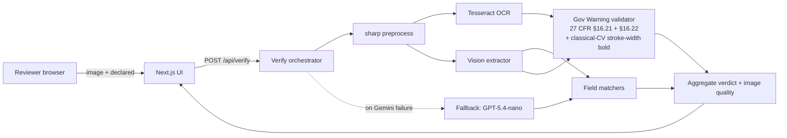

# Label Verify

[](https://github.com/XanderXML-Bit/label-verify/actions/workflows/ci.yml)

AI-powered verification of beverage-label artwork against COLA
application data. Prototype for the U.S. Department of the Treasury,
Alcohol and Tobacco Tax and Trade Bureau (TTB).

**Live demo:** <https://label-verify-six.vercel.app>
**Repo:** <https://github.com/XanderXML-Bit/label-verify>

---

## What it is

A reviewer drops a label image plus the COLA application data and gets
a structured **pass / fail / review** verdict on each of the seven
regulated fields — brand, class/type, ABV, net contents, producer,
country of origin, and the Government Warning statement under 27 CFR
§16.21 / §16.22 (text, all-caps prefix, bold prefix, type size).

The brief target was ≤ 5 s per label, beating the prior vendor's
30–40 s. The deployed primary path runs in **3.0 s P50**, **4.1 s P95**
on Gemini 3.1 Flash Lite at **$0.25 per 1,000 labels** (latest rerun
2026-05-12T23-44-56Z after removing OCR-as-hint from the vision prompt
shaved P95 from 4.6 s to 4.1 s).

## Headline measurement — combined-corpus bake-off (2026-05-12)

Field-level accuracy on a **170-image combined corpus**:
**90 SVG-rendered synthetic** labels (`test-data-v2/`) +
**80 photo-realistic** labels rendered by Codex across two batches
(`test-data/ai-generated/`). 1,169 field measurements (170 × 7 fields,
minus 3 images that the extractor failed to parse on the run). Wilson
95 % CIs.

| Subset | n | Accuracy | 95 % CI |
|---|---|---|---|
| **All** (combined) | 1,169 | **93.8 %** | [92.2, 95.0] |
| ID — synthetic SVG | 840 | 95.8 % | [94.3, 97.0] |
| OOD — photo-realistic | 329 | 88.4 % | [84.5, 91.5] |
| Government Warning false-negative rate | 137 | 5.1 % | [2.5, 10.2] |

**Honest framing.** Synthetic SVG is the easy case (rendered text the
model OCRs cleanly). The photo-realistic OOD subset is closer to real
TTB submissions and gives the more conservative 88 % accuracy. The
5.1 % Gov-Warning FN-rate is the regulator-dangerous direction (a
non-compliant warning slipping through as PASS). The **point
estimate** is inside the pre-registered ≤ 10 % criterion, but the
**Wilson 95 % CI upper bound is 10.2 %** — meaning the corpus is too
small (n=137 non-compliant labels) to conclude the criterion holds at
95 % confidence. A federal deploy would want a larger
human-adjudicated holdout before signing off on this number. Source
result file: `benchmarks/results/2026-05-12T23-44-56-393Z.md`. A side-
by-side test of Gemini **3 Flash Preview** scored 94.3 % overall but
failed the GW FN criterion outright (10.8 % point estimate), so 3.1
Flash Lite stays the deployed primary — see
[`docs/MODEL-SELECTION.md`](docs/MODEL-SELECTION.md) §4.3a.

This is the **bare-extractor** number — what the model alone gets
right. The orchestrator above the extractor adds:
- **Confidence-based deferral** — borderline PASS verdicts route to a
  human-review queue rather than ship a wrong-but-confident answer.
- **Producer-country inference** — labels that print "Portland, ME"
  without an explicit "USA" no longer mismatch the country field
  (added 2026-05-12; fixed a class of false-REVIEWs on US labels).
- **Auto-fallback** — if Gemini is unreachable, the request retries
  once against GPT-5.4-nano (OpenAI) before failing, with a yellow
  "verified via backup" banner on the result.

## How to use it

Open the live URL and choose one of three flows:

1. **Image + manual form** — drop a label image, fill the seven
   declared fields, click Verify. Standard COLA-style flow.
2. **Image + application file** — drop a label image, then upload the
   COLA application as PDF / JSON / CSV / Markdown / plain text / a
   photo of the form. The parser prefills the editable form; you
   confirm or edit; then Verify.
3. **Image-only "extract without verdict"** — for when you don't have
   the application data. Shows extracted fields and the Gov Warning
   subscore (federal regulation, independent of application data) but
   does NOT render a PASS / FAIL / REVIEW chip — a yellow banner
   makes the "not a verification" status unmissable.

**Batch verification** accepts up to the **quota-derived interactive
cap** (100 labels by default; scales with `GEMINI_RPM_LIMIT`). Two
ways to submit:

1. **Explicit manifest.** A CSV or JSON `manifest` field names each
   image by `filename` (or `file` / `image`) and inlines the seven
   declared fields. Use when your COLA system can export a structured
   manifest.
2. **Auto-pair by filename stem.** Drop image files (JPEG/PNG/WebP/
   HEIC) **and** application files (PDF/JSON/CSV/MD/TXT) in the same
   upload — no manifest needed. The route matches them by filename
   stem (case- and extension-insensitive), face-tag-stripped fallback
   for the `123-front.jpg` + `123-back.jpg` + `123.pdf` multi-face
   case, and parses each application file via the same parser the
   single-flow uses (PDFs with no extractable text auto-fall-back to
   vision OCR). The response includes a `pairing` summary so the
   operator sees exactly what was matched before any vision call
   fires.

Results stream back over SSE with a virtualised table and a download
in either **JSON** (full structured per-item VerifyResponse + status
tallies, `labelverify.v1.batch` schema) or **CSV** (one row per item
with per-field confidence + Gov-Warning subscores). Single-image
verifications expose the same JSON / CSV download. Very large
uploads are bounded by a 256 MiB aggregate request cap to keep the
in-memory serverless worker safe.

## Architecture at a glance



OCR runs in parallel with the vision call but its text is **not** fed
into the vision prompt — the C1 "OCR-as-hint" hypothesis was
falsified in the bake-off (it lowered accuracy on stylised fonts).
OCR's only role is to locate the Government Warning prefix bbox for
the classical-CV bold + size subscores.

Latency budget is honest: vision call dominates (~2 s P50), preprocess
+ OCR run in parallel, matchers + validators are sub-100ms. The
Government Warning's bold-prefix check uses pixel-level stroke-width
measurement on the OCR-located prefix bbox (classical CV — see
[`src/lib/validation/bold-size.ts`](src/lib/validation/bold-size.ts));
this is one place where measurement is genuinely better than asking an
LLM "is this bold."

## Methods considered

Full decision trail in
[`docs/ALTERNATIVES.md`](docs/ALTERNATIVES.md). Short version:

| Method | Realistic ceiling | Verdict |
|---|---|---|
| Classical CV / template matching | 60–75 % on imperfect photos | Brittle to R4 (angles/glare/occlusion) |
| Pure OCR + regex/rules (Tesseract / PaddleOCR) | 75–85 % (text only) | No semantic field assignment; measured 33 % on our corpus |
| Self-hosted open-weight VLMs (Qwen2.5-VL, Llama 4 Vision) | ~95 % ceiling, +GPU ops | Right choice for data-residency; wrong scope for take-home |
| Specialised Document AI (Textract, Google DocAI) | 98 % on clean forms | Out-of-paradigm — labels are graphic design |
| Custom CNN trained on TTB labels | Could approach 99 % with data | Need ~10 k labelled labels we don't have |
| Hybrid (YOLO + PaddleOCR + small classifier + LLM glue) | High ceiling, ~2 weeks engineering | Production choice; wrong for a 7-day prototype |
| **Hosted LLM vision (Gemini 3.1 Flash Lite)** | **95.8 % ID / 88.4 % OOD measured** | **Chosen — Pareto-dominant on accuracy/latency/cost** |

The brief explicitly permits cloud APIs (§8 Latitude: "free choice of
model provider"). §10 asks for graceful degradation when the hosted
model is unreachable — which we have, via the GPT-5.4-nano fallback. There is no reviewer- or API-selectable model mode in production; every request uses the same primary path and only falls back on provider failure.

## Models benchmarked

`npm run bench:bakeoff` ran a 13-variant tournament covering OpenAI
(GPT-4o-mini, GPT-4o, GPT-5.5, GPT-5.4-nano), Google (Gemini 3.1 Flash
Lite, Gemini 2.5 Flash, Gemini 3.1 Pro × 2 routing paths), Anthropic
(Claude Haiku 4.5, Claude Opus 4.7), Meta (Llama 4 Maverick), Mistral
(Medium 3.5), NVIDIA (Nemotron 3 Nano Omni), Alibaba (Qwen 3.6 Flash),
plus Tesseract baseline (T1) and an OCR+vision combination (C1). Full
table and the criterion-by-criterion winner justification in
[`docs/MODEL-SELECTION.md`](docs/MODEL-SELECTION.md) §4.

Why Gemini 3.1 Flash Lite won: 97.6 % on the routine 12-image
subset → 93.8 % on the combined 170-image corpus, 3.2 s P50, $0.25 per
1 k labels. The Pro Preview tier scored marginally higher (98.8 %) but
at 10× cost and 10× latency — Pareto-dominated for our 5-s budget.
Gemini 3 Flash Preview (newer, "smarter" sibling) was tested side-by-
side and scored 94.3 % but **failed** the ≤ 10 % Gov-Warning FN-rate
criterion (10.8 %) and cost 10× more per call — staying on 3.1 Flash
Lite. GPT-5.4 nano sits as the fallback at 92.9 % / 3.2 s / $1.25 per
1 k — a different provider in case Google is unreachable, and only
~5 pp behind primary. The C1 hypothesis (OCR-as-hint improves vision)
was **falsified** — OCR text fed into the vision prompt actually hurt
accuracy on this corpus, because the model defers to OCR errors on
stylised fonts. We ship vision-only.

## Procedure

The decisions in
[`MODEL-SELECTION.md`](docs/MODEL-SELECTION.md) §4 and
[`APPROACH.md`](docs/archive/APPROACH.md) §4 are pre-registered — predictions
written before measurements so we can show priors-vs-reality. After
the run, [`MODEL-SELECTION.md`](docs/MODEL-SELECTION.md) §4.3 records
what we got wrong (the C1 hypothesis was the biggest miss). McNemar
pairwise tests, Wilson 95 % CIs, OOD stratification all reported
honestly. The bench harness writes to
`benchmarks/results/<iso-timestamp>.{json,md}` so a future re-run is
reproducible: same script, same corpus, comparable numbers.

## Validation methodology

> **Proxy validation, not field validation.** The corpus is built
> from SVG-rendered synthetic labels and AI-generated photo-realistic
> labels. A federal deploy would require an additional
> human-adjudicated holdout of real-world COLA submissions before
> signing off — the numbers below are a credible *proxy* of the
> system's behaviour, not a substitute for that holdout. Source
> documents are in `test-data-v2/` (SVG) and
> `test-data/ai-generated/` (Codex photos); the ground-truth
> generation method is below.

- **Corpus.** 170 images. The 90 v2 labels are SVG-rendered from
  deterministic templates with hand-controlled
  Government-Warning failure modes (see
  [`docs/government-warning-cases.md`](docs/government-warning-cases.md)
  for the taxonomy). The 80 photo-realistic labels were rendered by
  Codex's built-in image-gen tool across two batches (50 + 30) and
  visually audited by a 4-sub-agent chunked review (see
  `test-data/ai-generated/manifest.json`). Batch 02 specifically
  targeted Gov-Warning paraphrase stress, photo-quality stress, and
  novel beverage categories — see
  [`docs/archive/CODEX-BATCH-02-HANDOFF.md`](docs/archive/CODEX-BATCH-02-HANDOFF.md).
- **Ground truth.** Each image has a JSON ground-truth file with all
  seven declared fields plus Gov-Warning subscore truths. Adjudication
  was the prompt-declared field set for synthetic; visual audit for
  AI-generated. The AI ground-truth was cross-validated by an
  independent Gemini 3.1 Pro Preview oracle pass on all 50 images
  (`.review/ai-corpus-cross-validation.md`) — drift on
  `country_of_origin` (Codex over-claims "USA" when no country marking
  is visibly present) was corrected during conversion to the v2
  schema.
- **Scoring.** Per-field PASS/FAIL via `compareBrand`,
  `compareClass`, `compareAbv`, `compareNetContents`,
  `compareProducer`, `compareCountry`, plus the four Gov-Warning
  subscores (text exact match / all-caps / bold via SWT / size
  threshold). Aggregated by worst-of rule.
- **Stats.** Wilson 95 % CI per technique × stratum. McNemar pairwise
  tests between candidate techniques.
- **A binary scorer caveat.** The bench treats a comparator REVIEW
  the same as a FAIL. That's deliberately strict: REVIEW means
  "needs a human," which on a strict accuracy metric should not
  count as correct. But it means the headline % understates
  orchestrator-level UX, where REVIEW is a routed-to-human verdict
  with a regulation-citing reason — not a refusal. The
  `country_of_origin` field is the canonical example: 14 OOD images
  return REVIEW (not FAIL) because the label doesn't visibly mark
  USA on a US-domestic bottle, which TTB regulation explicitly
  allows. They cost the bench number but are the correct production
  behaviour. See [`docs/FAILURE-MODES.md`](docs/FAILURE-MODES.md) §F1.

## Beyond the brief

- **Application-input parser** — PDF text extraction (pdfjs-dist),
  CSV/JSON parsing, Markdown / plain-text regex extraction, photo of
  the application form via vision. Three application-entry paths (manual / file /
  image-only) instead of just one.
- **Sample affordance** — three pre-populated examples (PASS / FAIL /
  REVIEW) so a reviewer sees an end-to-end result on first click. Now
  uses AI-photographed labels, not SVG; the prior SVG samples were
  best-case behaviour.
- **Confidence-based deferral** — borderline PASS verdicts auto-route
  to a human-review queue instead of shipping low-confidence
  approvals. Threshold `REVIEW_CONFIDENCE_THRESHOLD = 0.55` calibrated
  against the bake-off; documented in `verify.ts`.
- **Live elapsed timer + progress bar** during verify (instead of
  an indefinite pulse), with a soft "still working" message past
  10 s.
- **API status banner** — on page load, hits `/api/health` and warns
  the reviewer if a provider key is missing in the deployment env
  before they spend time filling the form.
- **Auto-fallback** — Gemini failure → GPT-5.4-nano with a clear
  banner on the result so the reviewer can't miss it.
- **Dark mode** — pre-paint inline script prevents FOUC; toggle
  persists in localStorage; full Tailwind dark-mode coverage tuned
  for AA contrast on both white and slate-900 panels.
- **Mobile-responsive** — 44 px touch targets, layout collapse under
  480 px, font-size policy in `globals.css`.

## Security posture

Mitigations applied (full audit trail in commit messages, last review
2026-05-12):

- SSRF guard on URL fetch — rejects RFC1918 + loopback + link-local +
  CGNAT + 255.255.255.255 multicast, AND non-canonical IPv4 literal
  forms (decimal `2130706433`, hex `0x7f000001`, octal
  `017700000001`). Manual redirect-following with re-validation at
  every hop.
- Prompt-injection guard — production paths omit OCR text from the
  vision prompt entirely (the C1 "OCR-as-hint" hypothesis was
  falsified in the bake-off, see `docs/MODEL-SELECTION.md` §3.5).
  The wrapping helper (`buildOcrHintSection` in
  `src/lib/vision/prompt.ts`) is retained for benchmark mode and as
  a defensive harness if the hypothesis is revisited: it caps at
  4 KB, strips control chars, escapes closing tags, and is paired
  with `EXTRACTION_PROMPT` Rule #11 telling the model to ignore any
  instructions found inside an `<untrusted_ocr>` block.
- Strict MIME allowlist on every upload endpoint (image: jpeg/png/
  webp/heic/heif; application: pdf/json/csv/md/txt/those images). SVG
  / GIF / BMP are 415'd at the route rather than rewritten upstream.
- Per-IP rate limiting on `/api/verify`, `/api/extract`,
  `/api/application/parse`.
- Producer-comparator implicit-USA inference is gated on **strict-
  format** US state code AND **at least one other corroborating
  producer component** — so a hallucinated state can't single-handedly
  pass an obviously-non-compliant country claim.
- Auto-fallback uses a fresh AbortController + remaining-budget timer
  — won't reuse an already-aborted signal from the primary call.
- Batch endpoint pre-checks `Content-Length` before buffering the
  multipart body (DoS guard at 256 MiB upper bound, with per-file 10 MB
  enforced inside the loop).
- Security headers in `vercel.json`: HSTS,
  `X-Content-Type-Options: nosniff`, `X-Frame-Options: DENY`,
  `Referrer-Policy: strict-origin-when-cross-origin`,
  `Permissions-Policy` deny-all on sensitive APIs,
  `Content-Security-Policy` `default-src 'self'; img-src 'self' data:
  blob:; connect-src 'self'; frame-ancestors 'none'`.

No authentication / persistent storage — it's a prototype per brief §9.

## Self-hosting

```bash
git clone https://github.com/XanderXML-Bit/label-verify.git
cd label-verify
cp .env.example .env.local
# Fill in at least GOOGLE_API_KEY (get one at
# https://aistudio.google.com/app/apikey).
# Optionally OPENAI_API_KEY for the fallback path.
npm install
npm run dev          # → http://localhost:3000
```

The deployed demo at <https://label-verify-six.vercel.app> uses my
(Xander's) Google API key for the duration of the take-home review.
For your own deploy: provision your own keys, push to Vercel, set
them in **Project Settings → Environment Variables**. The full set
the deployment expects:

| Var | Required? | Purpose |
|---|---|---|
| `GOOGLE_API_KEY` | yes | Primary vision (Gemini 3.1 Flash Lite) |
| `OPENAI_API_KEY` | recommended | Auto-fallback (GPT-5.4-nano) on Gemini outage |
| `OPENROUTER_API_KEY` | optional | Bake-off harness for the long tail |
| `MODEL_FALLBACK` | optional | Defaults to `gpt-5.4-nano` |
| `VISION_TIMEOUT_MS` | no | Fixed at 60000 in `verify.ts` for the single production path |
| `RATE_LIMIT_PER_MIN` | optional | Defaults to 60 |
| `GEMINI_RPM_LIMIT` | optional | Defaults to 30; batch cap is derived from this project-level Gemini RPM |
| `DEBUG_TOKEN` | optional | Gates `/api/debug/last` ring buffer |

For a custom hostname (e.g. `labelverify.yourdomain.com`): Vercel
Settings → Domains → Add → Vercel issues you a CNAME → add it to your
DNS provider (Cloudflare DNS works fine; set "DNS only" or "Proxied"
depending on whether you want the Cloudflare WAF in front). No
re-hosting needed — DNS routes to the Vercel deployment.

## How to verify

```bash
npm run typecheck    # tsc --noEmit, zero output expected
npm run test         # vitest run, ~370 tests
npm run lint         # next lint, only pre-existing warnings allowed
npm run bench:routine # quick bake-off sanity check (~15 min, ~$0.30)
npm run test:e2e:install && npm run test:e2e
                     # Playwright browser E2E tests
```

The `bench` family of scripts is documented in
[`docs/MODEL-SELECTION.md`](docs/MODEL-SELECTION.md) §3.5. The
benchmark results are committed under `benchmarks/results/` for
reproducibility.

## What's still rough

- **The 88.4 % OOD number.** Photo-realistic labels are harder than
  the SVG synthetics. The current orchestrator handles most of the
  gap via deferral (low-confidence PASS → REVIEW), but a future
  iteration would add a second-opinion vision call on borderline
  Government Warnings — calibrated against a larger real-photo
  corpus we don't have yet. Batch 02 (30 images focused on
  Gov-Warning paraphrase stress, photo-quality stress, and novel
  beverage categories) is already merged; the spec lives at
  [`docs/archive/CODEX-BATCH-02-HANDOFF.md`](docs/archive/CODEX-BATCH-02-HANDOFF.md)
  for reproducible regeneration.
- **Single point of dependency.** The deployed demo uses one Google
  API key; if that key is rate-limited, the fallback to GPT-5.4-nano
  fires but the OpenAI bill becomes the operator's problem.
- **5-second budget vs Vercel Hobby 30 s cap.** The verify call lands
  well under 5 s on a warm function, but cold-starts can flirt with
  the cap. A Pro-plan deployment has a 60 s timeout and no concern
  here.
- **Ground-truth adjudication.** AI-generated images have Codex's
  visual-audit notes as the truth source. A human re-audit of the
  ~20 OOD-failures would tighten the OOD number and tell us how much
  of the 12 % gap is model error vs ground-truth error.

## Documentation map

**Read these in order:**

1. [`docs/evaluation-brief.md`](docs/evaluation-brief.md) — the brief, verbatim
2. [`docs/MODEL-SELECTION.md`](docs/MODEL-SELECTION.md) — bake-off winner + justification (the headline report)
3. [`docs/ALTERNATIVES.md`](docs/ALTERNATIVES.md) — non-LLM methods considered
4. [`docs/FAILURE-MODES.md`](docs/FAILURE-MODES.md) — what the verifier gets wrong and why
5. [`docs/government-warning-cases.md`](docs/government-warning-cases.md) — §16.21/§16.22 non-compliance taxonomy
6. [`docs/REMAINING-IMPROVEMENTS.md`](docs/REMAINING-IMPROVEMENTS.md) — what we'd do next
7. [`docs/DEPLOYMENT.md`](docs/DEPLOYMENT.md) + [`docs/DEPLOYMENT-CHECKLIST.md`](docs/DEPLOYMENT-CHECKLIST.md) + [`docs/PRODUCTION-SMOKE.md`](docs/PRODUCTION-SMOKE.md) — production runbook
8. [`docs/openapi.yaml`](docs/openapi.yaml) — public API surface
9. [`SECURITY.md`](SECURITY.md) — threat model + mitigations
10. [`CONTRIBUTING.md`](CONTRIBUTING.md) — setup + extension points
11. [`CHANGELOG.md`](CHANGELOG.md) — submission timeline

**Pre-implementation planning docs** (kept for the audit trail; the
current state of the code is the authority):
- [`docs/archive/APPROACH.md`](docs/archive/APPROACH.md) — pre-registered hypotheses
- [`docs/archive/PROJECT-TODO.md`](docs/archive/PROJECT-TODO.md) — overnight sprint plan
- [`docs/archive/TODO.md`](docs/archive/TODO.md) — phase 1–8 work plan
- [`docs/archive/CODEX-HANDOFF.md`](docs/archive/CODEX-HANDOFF.md) + [`CODEX-BATCH-02-HANDOFF.md`](docs/archive/CODEX-BATCH-02-HANDOFF.md) — corpus generation prompts

The repo is documentation-first because, for a take-home, the
*decisions* demonstrate the candidate more than half-built features
do. Read the brief, then MODEL-SELECTION §4, and the rest follows.
