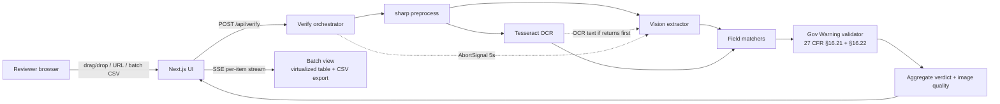

# Label Verify

[](https://github.com/XanderXML-Bit/label-verify/actions/workflows/ci.yml)

AI-powered verification of beverage label artwork against declared
application data. A prototype for the U.S. Department of the Treasury,
Alcohol and Tobacco Tax and Trade Bureau (TTB).

**Live demo:** **<https://label-verify-six.vercel.app>**

**Status:** Submission-ready (2026-05-12). Routine bake-off across 13
extractor variants complete — **Gemini 3.1 Flash Lite wins** at 97.6 %
accuracy, 2.3 s P50 latency, $0.25 per 1k labels. See
[`docs/MODEL-SELECTION.md`](docs/MODEL-SELECTION.md) §4 for the full
table; [`docs/ALTERNATIVES.md`](docs/ALTERNATIVES.md) covers why we
ruled out classical CV, pure OCR, self-hosted open-weight VLMs, and
custom-trained CNNs.

**Three input modes:**
1. **Image + manual application form** — fill the seven declared
   fields yourself; standard COLA verification flow.
2. **Image + uploaded application file** — drop a PDF / JSON / CSV /
   Markdown / plain-text / photo of the application form; the parser
   prefills the form, you review/edit, then click Verify.
3. **Image-only "extract without verdict"** — for when you don't have
   the application data on hand. Shows extracted fields and the
   Government Warning subscore (federal regulation, not application-
   derived) but does NOT render a PASS/FAIL/REVIEW chip.

Batch verify accepts up to 300 labels with a CSV/JSON manifest.

## Architecture at a glance



The vision extractor is selected by `MODEL_PRIMARY` in the server
environment. The benchmark harness (`npm run bench:bakeoff`) compared
13 variants across OpenAI (GPT-4o-mini, GPT-4o, GPT-5.5, GPT-5.4-nano),
Google (Gemini 3.1 Flash Lite, Gemini 2.5 Flash, Gemini 3.1 Pro), Anthropic
(Claude Haiku 4.5, Claude Opus 4.7), Meta (Llama 4 Maverick), Mistral
(Medium 3.5), NVIDIA (Nemotron 3 Nano Omni), Alibaba (Qwen 3.6 Flash),
plus Tesseract baseline (T1) and an OCR+Vision combination (C1).
**Gemini 3.1 Flash Lite (T6) wins.** See
[`docs/MODEL-SELECTION.md`](docs/MODEL-SELECTION.md) §4 for the full
table and the criterion-by-criterion justification.

## What it does

Given a label image (or a batch of up to 300) plus the values declared on
the COLA application, Label Verify returns a structured pass/fail verdict
for each regulated field:

- Brand name (fuzzy match)
- Class / type designation
- Alcohol by volume
- Net contents
- Government Warning statement — strict, including bold + all-caps prefix
- Producer / importer name and address
- Country of origin

End-to-end target: **≤ 5 seconds per label** (the previous vendor's
30–40 s was unworkable).

## Why this layout

This repo is documentation-first because, for a take-home, the *decisions*
demonstrate the candidate more than half-built features do. Read in this
order:

1. [`docs/evaluation-brief.md`](docs/evaluation-brief.md) — the requirements
   that drive everything. The "bible."
2. [`docs/REVIEW-PASS.md`](docs/REVIEW-PASS.md) — **the foundation review
   pass.** Eight independent critics (six Claude sub-agents + two Hermes
   sessions, one Treasury-persona and one skeptic) audited the v1
   foundation; this doc records what they said, what we changed, and what
   we deliberately did not.
3. [`docs/ARCHITECTURE.md`](docs/ARCHITECTURE.md) — system design, latency
   budget (honest P50 + P95), and per-item batch design.
4. [`docs/APPROACH.md`](docs/APPROACH.md) — the scientific framework for
   picking the verification engine. Includes a pre-registered kill
   criterion so the hypothesis can lose.
5. [`docs/TEST-STRATEGY.md`](docs/TEST-STRATEGY.md) — corpus design,
   ground-truth validation, Wilson CIs, stratified scoring, OOD reporting.
6. [`docs/government-warning-cases.md`](docs/government-warning-cases.md) —
   enumerated non-compliance test taxonomy for the strictest field
   (27 CFR § 16.21 + § 16.22).
7. [`docs/UI-SPEC.md`](docs/UI-SPEC.md) — UI/UX spec for a non-technical
   reviewer audience, with the Image-Quality / Verdict split that
   separates "your photo was bad" from "the label is non-compliant."
8. [`docs/DEPLOYMENT.md`](docs/DEPLOYMENT.md) — how the live URL is built
   and maintained.
9. [`TODO.md`](TODO.md) — prioritized backlog through 2026-05-18, with a
   **vertical slice first** philosophy after the review pass.

## Quick start (local)

```bash
git clone https://github.com/XanderXML-Bit/label-verify.git
cd label-verify
cp .env.example .env.local       # fill in keys (see docs/DEPLOYMENT.md §3)
npm install
npm run dev                       # http://localhost:3000
```

**Deploying to production?** Follow
[`docs/DEPLOYMENT-CHECKLIST.md`](docs/DEPLOYMENT-CHECKLIST.md) — a
non-Vercel-expert can take a fresh GitHub repo to a live HTTPS URL at
`labelverify.zendren.net` in ~60 minutes. After every deploy, run
[`docs/PRODUCTION-SMOKE.md`](docs/PRODUCTION-SMOKE.md) before sharing
the link.

> [`vercel.json`](vercel.json) is the **source of truth** for region,
> per-route memory, and per-route timeouts. Edit it in the repo, not in
> the Vercel UI — UI overrides drift silently from the code.

Other useful scripts:

```bash
# Corpus
npm run gen:corpus              # v1 generator → test-data/
npx tsx scripts/generate-corpus-v2.ts   # v2 generator → test-data-v2/
npm run validate:corpus         # zod schema + distribution + taxonomy

# Benchmark
npm run bench                   # all four techniques × full corpus
npm run bench:smoke             # 20-image subset; runs in CI

# Quality
npm run typecheck
npm run test                    # vitest (currently 70+ tests)
npm run lint
```

## What's deployed

- `/`                              — single-image verify + batch UI
- `POST /api/verify`               — multipart upload (JPEG / PNG / WebP / `application/pdf`) OR JSON `{ url, declared }`
- `POST /api/verify/batch`         — multipart manifest + folder of images
- `GET  /api/verify/batch/:id/stream` — SSE per-item streaming
- `GET  /api/health`               — `{ ok, model, version }`
- `GET  /api/warmup`               — warms sharp + Tesseract worker
- `GET  /api/debug/last`           — last 20 verifications, in-memory (gated by `DEBUG_TOKEN` env var)

All endpoints rate-limited (60/min/IP by default). SSRF-safe URL fetch.

## Project structure

```
label-verify/
├── README.md
├── TODO.md
├── docs/                  # The "why" — read these first
├── src/
│   ├── app/               # Next.js App Router (UI + API routes)
│   ├── lib/
│   │   ├── ocr/           # OCR adapters (Tesseract, etc.)
│   │   ├── vision/        # Vision-model adapters
│   │   ├── matching/      # Fuzzy + strict field comparators
│   │   └── validation/    # Regulated-field validators (Gov Warning, etc.)
│   └── tests/             # unit + integration
├── benchmarks/
│   ├── techniques/        # extractor implementations under test
│   └── results/           # committed JSON + Markdown of past runs
├── test-data/
│   ├── labels/            # synthetic + real test images
│   └── ground-truth/      # one JSON per image
└── scripts/
```

## Tech stack

- **Next.js 15** (App Router) + **TypeScript** strict
- **Tailwind** for the UI
- **sharp** for image preprocessing
- **tesseract.js** for local OCR (with word-level bounding boxes)
- **Google Gemini / OpenAI / Anthropic** for hosted vision (four-contender benchmark)
- **OCR + rule-based validators** as network-free graceful degradation
  (replaces the earlier Florence-2 / moondream2 local-VLM plan — see
  [`docs/REVIEW-PASS.md`](docs/REVIEW-PASS.md) §3.3 for why)
- **csv-parse** for batch manifest parsing
- **fast-fuzzy** for brand-name matching (Levenshtein + token-set)
- **vitest** for tests
- **Vercel** for deployment

Each choice is justified in
[`docs/ARCHITECTURE.md`](docs/ARCHITECTURE.md) §2.

## How we pick the verification engine

We benchmark, then decide. **Four contenders** (post-review-pass scope cut)
are evaluated against a 100-label corpus on accuracy, latency, cost, and
network-independence — T1 Tesseract baseline, T4 GPT-4o-mini Vision,
T6 Gemini 2.0 Flash Vision, C1 combined OCR + Vision. The hypothesis is
pre-registered with a kill criterion so the choice can lose. See
[`docs/APPROACH.md`](docs/APPROACH.md) for the methodology and
[`benchmarks/results/`](benchmarks/results/) for the data once runs land.

## Constraints we are designing around

- **5-second budget** — the previous vendor took 30–40 s and was rejected.
  See latency budget in [`docs/ARCHITECTURE.md`](docs/ARCHITECTURE.md) §4.
- **Mixed-tech-comfort reviewers** — the UI is designed for a 55-year-old
  who has never seen the app before. See
  [`docs/UI-SPEC.md`](docs/UI-SPEC.md).
- **Network-restricted environments** — government networks block many
  third-party domains, so a local-model fallback path is part of the
  design from day one.

## License

MIT — prototype, no warranty, etc.
